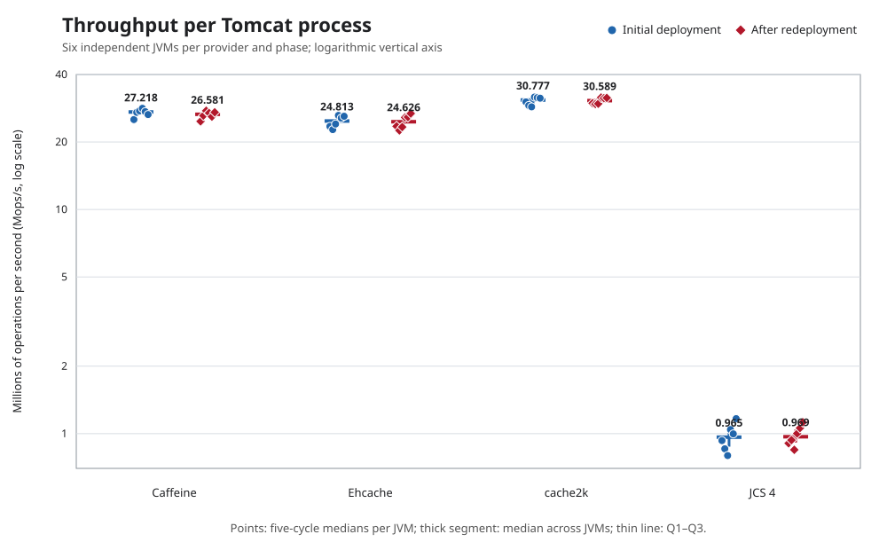
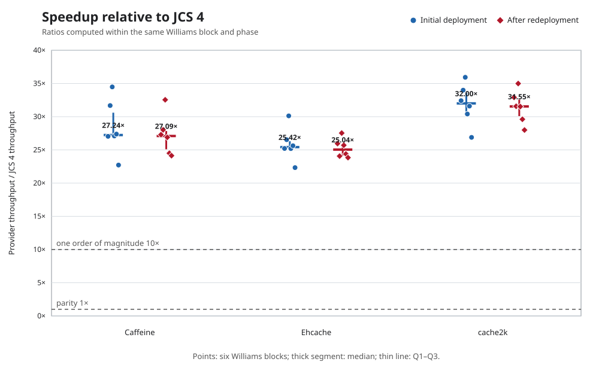
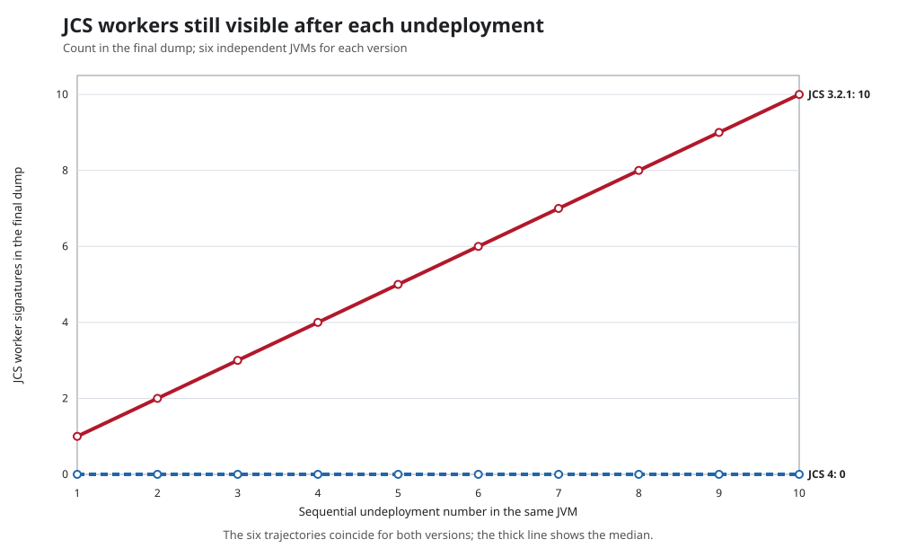

# Beyond Throughput: A Reproducible Benchmark of Java Caches in a Tomcat Lifecycle

*Performance, observable correctness, and post-undeploy signals of Java caches integrated into a web application*

Thomas Buffagni

LinkedIn: <https://www.linkedin.com/in/thomasbuffagni/>

Version 1.0.1 — 4 September 2026  
License: Creative Commons Attribution 4.0 International (CC BY 4.0)

**Keywords:** Java caching systems, local in-memory caches, reproducible benchmarking, software performance engineering, Apache Tomcat, JVM lifecycle, web application redeployment, memory leak detection.

## Abstract

This study compares Caffeine, Ehcache, cache2k, and Apache Commons JCS within a Tomcat web application, observing the complete lifecycle of deployment, load, removal, and redeployment. The objective is not to establish which cache is best in absolute terms, but to construct a verifiable comparison that jointly considers correctness, performance, and resource release.

The protocol was defined and frozen before data collection. Each condition was executed in a separate JVM, while keeping the application, environment, and workload unchanged. In the configured local in-memory path, **the throughput of Caffeine, Ehcache, and cache2k ranges from 25.04 to 32.00 times that of the JCS 4 snapshot, considering the medians of comparisons performed in the same test phase**. The result measures this specific application integration and does not automatically extend to all project features or configurations.

The test following application removal also reproduced, in **6/6 JCS 3.2.1 replicates**, the defect whereby some workers remained active. The same defect appeared in **0/6 replicates of the JCS 4 snapshot**, which incorporates the fix developed after JCS-248. The finding concerns this specific problem, not every possible form of memory retention. The protocol, data, and tools make the comparison reproducible and provide the baseline for determining, in a subsequent study, whether JCS can narrow the performance gap without sacrificing correctness or redeployment behavior.

## 1. Introduction

A cache embedded in the JVM is more than a concurrent map. It may manage expiration, callbacks, loading, and thread pools. These functions affect both service under load and what remains when the application is stopped.

The problem is tangible in servlet containers. Tomcat may remain active while successive versions of the same application are installed and removed. Each deployment uses its own *class loader*, the component that loads the WAR classes. A thread started by the application need not necessarily disappear in every implementation, but it must terminate or release the references that keep the old class loader reachable. A thread name alone demonstrates neither ownership nor retention: temporal sequence, stack traces, warnings, and, in ambiguous cases, analysis of references from GC roots are required [2, 3].

A test that terminates together with the JVM does not observe this phase. Conversely, adding a single memory count to a throughput test does not solve the problem: heap and native memory belong to the entire process. The study therefore separates three layers of evidence:

1. observable compliance with the stated workload;
2. performance of the application path under load;
3. signals collected after removal of the web application.

The objective is not to proclaim one cache best in absolute terms. It is to produce an auditable comparison in which the artifact, environment, workload, Tomcat sequence, and analysis rules are known before the results are examined.

## 2. Research questions and contributions

The study addresses three main questions.

- **RQ1 — Observable correctness.** Does each condition complete the minimum workload and satisfy the stated checks on hit rate, population, single-flight behavior, and return to service after redeployment?
- **RQ2 — Application performance.** What throughput and latency distributions are observed for the four primary providers when using the same application path and distinct JVM processes?
- **RQ3 — Tomcat lifecycle.** After undeployment, which threads, warnings, and process-wide changes in heap, native memory, and class loaders are observable over successive cycles?

The memory leak identified while analyzing JCS 3.2.1 and its failure to reproduce in the JCS 4 snapshot are treated in a separate section. The subsequent registration of the defect as JCS-248 documents the report and the upstream fix; the case is not used to explain throughput differences and is not the focus of the paper.

The verifiable contributions are:

- a common harness that performs two complete deployments in each cycle;
- a balanced design with paired schedules and a new JVM for each replicate;
- semantic gates checked before admission to performance comparisons;
- post-undeploy diagnostics with actual timings and archived artifacts;
- a package from which tables and charts can be regenerated from the raw data.

Hereafter, *observable correctness* means only compliance with the contract verified by the harness. It is not a general proof of library correctness or of all their eviction, expiration, and concurrency policies.

## 3. What the benchmark measures

The timed window traverses the condition adapter, common counters, application-level concurrency, and the provider API. The HTTP request starts the test, but the HTTP round trip is not included in the timer. The measurement therefore characterizes the path used by the application, not the isolated cost of the data structure alone.

| Dimension | Evidence produced | Interpretive limitation |
|---|---|---|
| Throughput | Completed operations divided by actual elapsed time | Does not localize the cost to the cache engine alone |
| Latency | Percentiles of operations sampled in the adapter | Is neither end-to-end HTTP latency nor an SLO guarantee |
| Observable correctness | Duration, operations, hit rate, two population counts, single-flight behavior, and redeployment | Does not demonstrate complete equivalence among native APIs |
| Threads and warnings | IDs, names, stack traces, and Tomcat messages | A live thread is not automatically a leak; whether it retains references to the WAR must be verified |
| Class loaders and `findleaks` | Post-undeploy series and occurrences of the context path | `findleaks` occurrences do not count distinct class loaders |
| Heap and NMT | Whole-process values at the stated checkpoints | Does not attribute memory to the cache alone |

### 3.1 The complementary role of JMH

JMH is a harness for JVM benchmarks ranging from nano- to macrobenchmarks [1]. In this study, however, the experimental unit comprises a Tomcat process and the entire WAR lifecycle; the primary measurements are therefore orchestrated externally. Targeted JMH benchmarks could help isolate the cost of individual internal paths, but they do not replace observations of deployment, undeployment, and post-undeploy signals.

## 4. Method

### 4.1 Protocol defined before execution

The normative protocol is [`protocollo-campagna-v4-2.md`](protocollo-campagna-v4-2.md), SHA-256 `4F364DE62F696C687D3175931F29C69013F4AD9D96303558E2444BFC5C73596F`. It was frozen on September 2, 2026, before acquisition, and defines conditions, experimental units, admission criteria, measurements, and analysis rules. Its hash is recorded in the dataset provenance; all manuscript values derive exclusively from validated v4.2 artifacts.

### 4.2 Systems, governance, and versions

#### 4.2.1 Project profiles

The four engines are not variants of the same product: they have different objectives, functional scope, and governance models. Their age is reported as historical context, not as an automatic indicator of quality or performance. The reference date is September 3, 2026. Where a project does not state a founding date, the first revision of the current public repository is reported; this date may not encompass any earlier work.

| Project | Version or revision tested | Project maintainer (according to official metadata) | Project license | Publicly documented origin |
|---|---|---|---|---|
| Caffeine | `3.2.4`, released on May 3, 2026 | Independent project in the `ben-manes/caffeine` repository; the POM lists Ben Manes in the `owner` and `developer` roles, with contributions managed publicly on GitHub | Apache License 2.0 | Current repository started on December 13, 2014: approximately 11 years and 9 months at the time of the study [6, 18] |
| Ehcache | Maven artifact `org.ehcache:ehcache:3.12.0`, published on April 3, 2026; the `v3.12.0` source tag points to commit `f4a96f4` | Repository of the `ehcache` organization; the artifact POM identifies IBM Corp. and the *Terracotta Engineers*. The Ehcache 3.11 release notes describe that line as the first new release under IBM ownership | Apache License 2.0 | Ehcache was introduced in October 2003, almost 23 years before the study; the repository for the Ehcache 3 line begins in February 2014 [7, 19] |
| cache2k | `2.6.1.Final`, released on February 7, 2022 | Project hosted by the `cache2k` organization; the main POM identifies headissue GmbH and Jens Wilke, who is also the author of the official guide | Apache License 2.0 | Current repository started on December 18, 2013: approximately 12 years and 9 months; source-code headers report copyright from 2000, which alone is not equivalent to a first-publication date [8, 21] |
| Apache Commons JCS | Release `3.2.1`, published on May 27, 2024, and snapshot `4.0.0-SNAPSHOT` at commit `fb3f101b` of September 1, 2026 | Apache Software Foundation project, developed within Apache Commons under the supervision of the Commons PMC and with community contributions | Apache License 2.0 | The official website dates its development and use to 2001 and the formal creation of the project to 2002: approximately 24–25 years of history [16, 17, 22] |

The four codebases therefore use the same permissive license, but not the same accountability model: Caffeine is led by the maintainer who hosts the repository, cache2k identifies a contact person and an organization, Ehcache is maintained in a corporate context, and JCS follows the community governance of the Apache Software Foundation. The stated license applies to the project code; transitive dependencies may be subject to different licenses.

One clarification concerns Ehcache `3.12.0`. The artifact and its POM are available on Maven Central, but as of the reference date the project's releases page identifies `3.11.1` as the latest release and contains no release object for `3.12.0`; the matter is recorded in public issue #3325 [7, 19, 20]. The benchmark separately identifies the binary artifact executed, verified by checksum, and the `v3.12.0` source tag at commit `f4a96f4`, without assigning the artifact the unverified label of “latest official release.”

#### 4.2.2 Technical scope observed

The following table distinguishes what each project can do in general from what the benchmark actually exercises. This distinction is essential: a result obtained on the local cache in the *heap*—the memory managed by the JVM—does not automatically characterize the distributed modules, disk, *off-heap* storage—memory outside that area—or integrations offered by the same project. *JCache* denotes the Java JSR 107 standard, which provides a common API for different caches.

| Project | General project scope | Configuration measured in this study | Features not evaluated |
|---|---|---|---|
| Caffeine | Local in-memory cache with synchronous or asynchronous loading, automatic removal when the limit is exceeded (*eviction*), expiration, and updating (*refresh*) | JVM heap, limit of 10,000 entries, expiration 300 s after writing, `getIfPresent` read; native statistics disabled | Asynchronous APIs, refresh, weak/soft references, JCache module, and policies other than the one configured [6, 18] |
| Ehcache | Local or tiered cache, with heap, off-heap, and disk storage; JCache support and clustering options | JVM heap only, limit of 10,000 entries, time to live (TTL) of 300 s, and `Cache.get` access | Off-heap, disk, persistence, transactions, JCache, and Terracotta clustering [7, 19] |
| cache2k | Local in-memory cache with expiration, updating, automatic loading, temporary error handling, statistics, and JCache module | `entryCapacity` 10,000, expiration 300 s after writing, and `peek` read, with no native loader configured | Refresh, resilience, native loader, JCache, and application integrations [8, 21] |
| Apache Commons JCS | Composite cache organized into *regions*—logical caches, each with its own name and configuration—with memory, disk, lateral communication, and remote-server plugins | A single, exclusively in-memory region using `LRUMemoryCache`, which removes the least recently used entries first; `MaxObjects=10,000`, maximum lifetime 300 s, and no auxiliary plugin. The JCS 4 snapshot is included in the performance comparison, JCS 3.2.1 in the separate lifecycle analysis | Disk cache, lateral replication, remote server, failover, other memory managers, and JCache module [17, 22] |

`no-store` does not appear in this overview because it is neither an external project nor a caching engine: it is the benchmark's internal control, described among the experimental conditions below.

#### 4.2.3 Experimental conditions

The six conditions are compiled into the same WAR and image. Each process executes only one condition, so singletons and global resources from different providers do not coexist in the same JVM.

| Code | Condition | Version or revision | Role |
|---|---|---|---|
| A | Caffeine | 3.2.4 [6] | Primary performance comparison |
| B | Ehcache | 3.12.0 [7] | Primary performance comparison |
| C | cache2k | 2.6.1.Final [8] | Primary performance comparison |
| D | JCS 4 snapshot | 4.0.0-SNAPSHOT, commit `fb3f101b87709b713468e8d827b8612e6e65f29b` [16] | Primary performance comparison; includes the fix for the leak analyzed separately |
| E | Apache Commons JCS | Released version 3.2.1 [17] | Line in which the worker-induced memory leak was identified; separate lifecycle analysis |
| F | `no-store` | No cache library: writes are ignored and reads never find the data | Reference for distinguishing infrastructure signals from cache signals; excluded from the performance comparison |

In simple terms, `no-store` is equivalent to repeating deployment, load, and undeployment with the “cache engine” absent. Tomcat, the WAR, the adapter, counters, and common diagnostics remain active, but no data are retained and no resources belong to a caching library. This makes it useful in the lifecycle comparison: a phenomenon observed both with a cache and with `no-store` cannot be attributed to the cache alone on the basis of that evidence. Its throughput is not compared with that of the providers, however, because each read triggers a new load and the work performed is deliberately different.

Versions are verified against artifact coordinates and immutable source revisions [4, 6–8, 16, 17]. The container base uses Tomcat `11.0.24`; the cited source is pinned to the corresponding commit [4].

| Condition | Native read | Limit and TTL | Entry count | Required shutdown |
|---|---|---|---|---|
| Caffeine | `getIfPresent` | `maximumSize`, `expireAfterWrite` | `estimatedSize` after cleanup | invalidation and cleanup |
| Ehcache | `get` | heap entries, TTL | iteration over mappings | `CacheManager.close()` |
| cache2k | `peek` | `entryCapacity`, `expireAfterWrite` | `CacheControl.getSize()` | `Cache.close()` |
| JCS 4 and JCS 3.2.1 | `CacheAccess.get` | `LRUMemoryCache`, `MaxObjects`, element attributes | `CacheControl.getSize()` | `dispose()` and `JCS.shutdown()` |
| `no-store` | always reports “data not present” (*miss*) | not applicable | always zero | reset of common counters |

Hits and misses are counted by the common adapter. Native statistics are archived as diagnostics but do not replace these counters. Caffeine's `recordStats()` remains disabled, avoiding the introduction of optional telemetry into the primary path for that condition alone.

### 4.3 Environment, replicates, and order

| Frozen parameter | Value |
|---|---|
| Runtime | Apache Tomcat 11.0.24 on Eclipse Temurin 25 |
| Runtime image | `tomcat:11.0.24-jdk25-temurin-noble` pinned by digest |
| Container CPU | quota of 4 vCPUs |
| Container memory | 1,536 MiB |
| JVM heap | `-Xms256m -Xmx768m`, G1 |
| Native Memory Tracking | `summary` |
| Artifact | same WAR for all conditions |

The preflight records and verifies image digests, JVM and Tomcat versions, cgroup limits, visible CPUs, kernel, JVM options, and checksums of the WAR and the two JCS lines. These data describe the actual execution and are not inferred solely from configuration files.

In this study, a **JVM** (*Java Virtual Machine*) is an independent Java process running its own Tomcat instance and the WAR under test. To obtain a new replicate, the container and JVM are recreated from scratch: the subsequent run therefore inherits no Java objects, threads, or caches from the preceding one. Hereafter, this independent replicate is also called a *fork*.

Six independent JVMs are started for each of the six conditions. Within each JVM, the test is then repeated five times without restarting the process. Each repetition is called a **cycle** and comprises two workload measurements: one on the initial deployment and one after removing and reinstalling the WAR. The five cycles within the same JVM are therefore repeated measures; they are not five independent replicates.

The six JVMs for each condition do not share Java state, but they run sequentially on the same host and therefore do not represent six different physical machines. The choice of six replicates the complete Williams design once and does not derive from a formal statistical power calculation. A *valid JVM* is a process that passed the infrastructure-integrity and provenance checks; an *admitted window* is a single workload measurement that also passed the functional checks described in Section 4.6.

| Planned quantity | Value |
|---|---:|
| Experimental conditions | 6 |
| Independent Tomcat processes per condition | 6 |
| Total Tomcat processes | 36 |
| Complete cycles repeated in each process | 5 |
| Total cycles | 180 |
| Workload measurements per cycle | 2: initial deployment and after redeployment |
| Total workload measurements | 360 |

In summary: **6 conditions × 6 independent processes × 5 cycles = 180 cycles**; because each cycle contains two workload measurements, the number of measured windows is **180 × 2 = 360**.

The design takes its name from E. J. Williams's 1949 work on so-called *change-over* experiments, now generally classified within the family of *crossover* designs. In the original problem, several treatments are applied successively to the same experimental unit; the order must therefore make it possible to distinguish the effect of the current treatment from any residual effect of the preceding one. Williams showed how to construct sequences balanced with respect to this immediate residual effect. With an even number of treatments, balance can be achieved with a single Williams square: for six treatments, six sequences of six periods are sufficient [23, 24].

The literature defines a design of this kind as balanced for first-order carryover effects when each treatment occurs with equal frequency in each period and is preceded with equal frequency by every other treatment [23, 24]. In this study, however, the application is an adaptation for benchmarking: the caches are not run one after another in the same JVM, but in independent processes. The Williams grid is used to counterbalance the temporal order of runs on the same host, not to estimate a carryover effect between caching engines.

In practical terms, the Williams design is the benchmark schedule, not an additional test or a statistical correction applied after the results have been observed. It establishes the order in which the six conditions are executed.

Order matters because the runs occur sequentially on the same host. If they were always launched as A, B, C, D, E, F, condition A would always be measured first and F always last. A difference might then reflect, at least in part, the timing of execution—for example, CPU temperature and frequency, background activity, or operating-system caches—rather than only the provider. Recreating the container and JVM prevents direct sharing of Java state, but does not make the temporal position of the run irrelevant.

The 6 × 6 Williams design therefore organizes six *blocks*, each consisting of one run of all six conditions. Across the blocks, two balancing rules hold:

1. each condition appears once in each position, from first to sixth;
2. each condition is executed immediately after every other condition exactly once.

For example, A does not always occupy the beginning of the sequence: across the six blocks it appears once in each of the six positions and is preceded once by B, C, D, E, and F. In this way, advantages or disadvantages associated with position and with the immediately preceding condition are distributed among all providers rather than systematically burdening only one. The design reduces these potential biases, but it does not eliminate all temporal variation or turn the six replicates into six independent machines.

The requests sent to the caches are not generated freely for each run. Two fixed values, `24301` for the workload and `2482026` for the campaign, make it possible to construct the sequence of keys to be read deterministically. Combining them with the block and cycle numbers yields a different access plan for each cycle, but one that is controlled and reproducible.

Within the same block and cycle, all caches receive exactly the same sequence of requests; the sequence is also reused before and after redeployment. Thus, any difference cannot depend on one provider having received more favorable keys or access patterns than another. Anyone repeating the experiment with the same values can reconstruct the same plans. In technical terminology, the two fixed values are called *seeds*; the numbers themselves have no performance significance.

When a provider is compared with JCS 4, the throughput ratio is calculated between measurements belonging to the same block and the same test phase. The two runs therefore follow the same plan, even though they are executed in distinct JVMs.

| Block | Order A–F |
|---:|---|
| 1 | A, B, F, C, E, D |
| 2 | B, C, A, D, F, E |
| 3 | C, D, B, E, A, F |
| 4 | D, E, C, F, B, A |
| 5 | E, F, D, A, C, B |
| 6 | F, A, E, B, D, C |

### 4.4 Workload and application-level checks

| Parameter | Fixed value |
|---|---:|
| Loaded entries | 10,000 |
| Payload | 512 ASCII bytes encoded as UTF-8; not heap occupancy |
| Workers | 8 |
| Target hit rate | 95% |
| TTL | 300 s |
| Plan | uniform, read-only, deterministic, and pregenerated |
| Minimum per window | 400,000 operations and at least 5.0 s |
| Minimum warm-up | 50,000 operations and at least 3.0 s |
| Latency sampling | 1 operation out of every 64 per worker |
| Write probe outside the measurement window | 5,000 `put` operations |
| Single-flight test outside the measurement window | 16 callers, artificial loader with a 25 ms delay |

The load is *closed-loop*: each worker starts its next operation when the previous one completes. The plan is repeated until both minima, operation count and duration, have been met. The result records the actual number of operations, the duration, and the overshoot.

Warm-up and measurement use the same provider instance. After warm-up, the cache and counters are reset before the measured fill. The performance segment contains reads only. The fill, write probe, and single-flight test are outside the primary window and do not support conclusions about write speed.

The cache population is read at two non-interchangeable points:

1. `providerMetricsAfterWorkload`, immediately before the write probe;
2. `providerMetricsAfterWriteProbe`, after the 5,000 diagnostic `put` operations.

The gate requires both explicit records. After the second checkpoint, the single-flight test launches 16 callers against a controlled loader: the check passes if all calls complete and the loader is invoked exactly once. The test belongs to the common adapter and is not presented as equivalent native semantics across the engines.

### 4.5 Tomcat sequence and post-undeploy diagnostics

Each cycle runs the same sequence twice, before and after redeployment.

| Step | Action | Evidence |
|---:|---|---|
| 1 | Baseline with the WAR absent | JVM state before deployment |
| 2 | Deployment and readiness | Idle snapshot |
| 3 | Warm-up, reset, fill, and workload | Measurements, two checkpoints, write probe, and single-flight test |
| 4 | Loaded snapshot, then undeployment | Loaded state and removal time |
| 5 | Minimum wait of 2 s after undeployment | Thread dump and log delta; no explicit GC by the runner |
| 6 | Minimum wait of 10 s after undeployment | Start of `findleaks`, followed by two `GC.run` calls; then heap, class-loader, thread, NMT, and class-histogram data |
| 7 | Redeployment | New WAR generation and new provider |
| 8 | Repetition of the same plan | Second complete window |
| 9 | Second undeployment | Same early and final diagnostics |

The 2- and 10-second values are minimum thresholds for starting the two sequences, not exact times at which all measurements would be available. A monotonic clock starts immediately after the undeployment call returns and records the start and completion of the early diagnostics, the start of the final diagnostics, the completion of `findleaks`, and the completion of the last snapshot.

The final diagnostic sequence is sequential, GC-assisted, and intrusive. The Manager command `findleaks` delegates to `StandardHost.findReloadedContextMemoryLeaks()`, which invokes `System.gc()` [3, 4]. This invocation issues a request to the JVM; it does not guarantee that collection will occur or that any specific set of objects will be reclaimed [5]. Immediately afterward, the runner issues two additional `jcmd GC.run` requests and then captures, in sequence, heap data, class-loader statistics, a thread dump, Native Memory Tracking (NMT), and a class histogram. The final values describe the state after this induced diagnostic sequence, not a passive progression measured at exactly 10 seconds.

After the second undeployment in the fifth cycle, a heap dump is requested for JCS 3.2.1 and for the JCS 4 snapshot. The diagnostic artifacts retain their checksums and their association with the interval that produced them.

### 4.6 Correctness and admission gates

| Check | Caches | `no-store` |
|---|---|---|
| Minimum work | `measuredOperations ≥ 400,000` and duration ≥ 5.0 s | same criterion |
| Uniform hit rate | 95% ± 0.5 percentage points | no data found: 0% hit rate |
| Entries after workload | at least 9,900 | zero |
| Entries after write probe | at least 9,900 | zero |
| Single-flight | loader invoked exactly once | not applicable |
| Redeployment | readiness and complete repetition of the same plan | same criterion |

A semantic violation remains in the raw data; it does not become an infrastructure error. A fork–phase pair enters the primary performance summary only if all five cycles in that phase pass the gate; in the analysis excluding the first cycle, cycles 2–5 must pass it. An OOM, unexpected restart, timeout, incorrect checksum, or missing mandatory diagnostic instead invalidates the entire Williams block, which may be repeated only if the failed attempt and the reason for repeating it are retained.

### 4.7 Statistical summary

For each provider and phase, the summary is computed in two stages:

1. the median of the five cycles within each JVM;
2. the median, first and third quartiles, and minimum–maximum range across the medians of the admitted JVMs.

The figures reported in the abstract and main tables are therefore **medians across JVM processes**, not averages of the 30 windows. The denominator `n` is always shown. Q1 and Q3 use linear interpolation at position `(n−1)p`.

Ratios to JCS 4 are calculated within the same block and phase before summarization: `provider throughput / JCS 4 throughput`. The median of the paired ratios is not the ratio of two medians.

The p50, p95, and p99 latencies derive from the systematic 1/64 sample. The nearest-rank method is used for each window; window percentiles are summarized first within each JVM and then across JVMs. The closed-loop load does not correct for *coordinated omission*, that is, the absence of new arrivals while a slow request is still executing.

The sensitivity analysis recomputes the summaries over cycles 2–5. It is a descriptive robustness check, not a causal estimate of the effect of the first cycle: temporal order, JIT compilation, process state, and other phenomena change together. If the admitted forks differ between the primary and sensitivity analyses, both denominators and their intersection are shown.

For each JVM, drift across cycles is described by the slope \(b\) of the line \(y_c=a+bc\), estimated by ordinary least squares over the five final checkpoints \(c=1,\ldots,5\) following the second undeployment. The slope expresses the change in the indicator per cycle; with five observations, it is a descriptive summary, not an inferential test for trend. The estimator is fixed in the runner: the protocol specified in advance the use of within-JVM slopes but did not state the formula explicitly. For class loaders, \(y_c\) is the process-wide number of `ParallelWebappClassLoader` rows returned by `VM.classloader_stats`, not the number of retained objects. Cycles belonging to different processes are not concatenated. No composite scores, subjective weights, automatic outlier removal, or automatic winner are defined.

## 5. Protocol adherence

No deviation from the protocol's machine-verifiable parameters is recorded in the dataset. The OLS formula was already implemented in the frozen runner but was not stated explicitly in the textual document: this is a shortcoming in the protocol documentation produced before the analysis, not a change introduced after the analysis. This statement applies only to discrepancies detectable from the archived artifacts and checks.

## 6. Results

The values in the tables are extracted from the v4.2 dataset after validation of the raw data, regeneration of the analysis, and provenance checks.

### 6.1 Completeness and semantic gates

| Condition | Processes recorded / 6 | Valid JVMs / 6 | Windows recorded / 60 | Gates passed / 60 | Admitted fork–phase pairs / 12 |
|---|---:|---:|---:|---:|---:|
| Caffeine 3.2.4 | 6/6 | 6/6 | 60/60 | 60/60 | 12/12 |
| Ehcache 3.12.0 | 6/6 | 6/6 | 60/60 | 60/60 | 12/12 |
| cache2k 2.6.1.Final | 6/6 | 6/6 | 60/60 | 60/60 | 12/12 |
| JCS 4 snapshot | 6/6 | 6/6 | 60/60 | 60/60 | 12/12 |
| JCS 3.2.1 | 6/6 | 6/6 | 60/60 | 60/60 | not applicable |
| `no-store` | 6/6 | 6/6 | 60/60 | 60/60 | not applicable |

| Design check | v4.2 outcome |
|---|---:|
| Complete Williams blocks / 6 | 6/6 |
| Invalidated blocks / 6 | 0/6 |
| Repeated blocks / 6 | 0/6 |
| Distinct containers / 36 admitted JVMs | 36/36 |

The denominators in the following tables must conform to the admission rules; an excluded measurement remains available in the raw data.

### 6.2 Evidence observed for RQ1

The tables report the observed extrema across the 60 windows for each condition. Duration and operation count are minimum thresholds: higher values are expected in the closed-loop cycle. The first panel describes workload completeness and return to service.

| Condition | Gates / 60 | Duration s, min–max | Operations, min–max | Post-redeployment `ready` / 30 |
|---|---:|---:|---:|---:|
| Caffeine 3.2.4 | 60/60 | 5.002–5.058 | 117,862,400–146,047,744 | 30/30 |
| Ehcache 3.12.0 | 60/60 | 5.001–5.055 | 100,211,456–136,797,440 | 30/30 |
| cache2k 2.6.1.Final | 60/60 | 5.002–5.057 | 119,192,320–164,146,176 | 30/30 |
| JCS 4 snapshot | 60/60 | 5.001–5.003 | 3,020,544–6,275,840 | 30/30 |
| JCS 3.2.1 | 60/60 | 5.000–5.002 | 9,653,760–16,205,056 | 30/30 |
| `no-store` | 60/60 | 5.005–5.068 | 456,135,424–535,899,904 | 30/30 |

The second panel shows the semantic checks. The hit rate is expressed as a percentage; cache populations are read before and after the write probe. `Single-flight` reports tests passed out of tests applicable.

| Condition | Hit rate %, min–max | Population after workload, min–max | Population after write probe, min–max | Single-flight |
|---|---:|---:|---:|---:|
| Caffeine 3.2.4 | 94.895–95.077 | 10,000–10,000 | 10,000–10,000 | 60/60 |
| Ehcache 3.12.0 | 94.895–95.076 | 10,000–10,000 | 10,000–10,000 | 60/60 |
| cache2k 2.6.1.Final | 94.702–94.871 | 9,979–9,979 | 9,990–9,996 | 60/60 |
| JCS 4 snapshot | 94.897–95.076 | 10,000–10,000 | 10,000–10,000 | 60/60 |
| JCS 3.2.1 | 94.896–95.076 | 10,000–10,000 | 10,000–10,000 | 60/60 |
| `no-store` | 0.000–0.000 | 0–0 | 0–0 | not applicable |

### 6.3 Throughput

Each row summarizes the per-JVM medians of the five cycles. Units are millions of operations per second (Mops/s).

| Provider | Phase | Admitted forks / 6 | Median across forks | Q1–Q3 | Min–max |
|---|---|---:|---:|---:|---:|
| Caffeine | initial | 6/6 | 27.218 | 26.662–27.484 | 25.185–28.263 |
| Caffeine | redeployment | 6/6 | 26.581 | 26.024–27.083 | 24.720–27.569 |
| Ehcache | initial | 6/6 | 24.813 | 23.626–25.935 | 22.716–26.281 |
| Ehcache | redeployment | 6/6 | 24.626 | 23.370–25.815 | 22.523–26.800 |
| cache2k | initial | 6/6 | 30.777 | 29.373–31.485 | 28.695–31.716 |
| cache2k | redeployment | 6/6 | 30.589 | 29.682–31.446 | 29.544–31.578 |
| JCS 4 snapshot | initial | 6/6 | 0.965 | 0.875–1.032 | 0.799–1.167 |
| JCS 4 snapshot | redeployment | 6/6 | 0.969 | 0.913–1.045 | 0.847–1.124 |

**Figure 1.** Throughput of the adapter–provider path. Each point represents the median of the five cycles from one independent JVM; the thick segment indicates the median across the six JVMs, and the thin line shows the Q1–Q3 interval. The logarithmic scale makes it possible to show JCS 4 and the other providers in the same panel without concealing their variability.

**Paired ratios relative to the JCS 4 snapshot**

| Provider | Phase | Admitted pairs / 6 | Median ratio | Q1–Q3 | Min–max |
|---|---|---:|---:|---:|---:|
| Caffeine | initial | 6/6 | 27.24× | 27.05–30.60× | 22.72–34.48× |
| Caffeine | redeployment | 6/6 | 27.09× | 25.10–27.84× | 24.13–32.54× |
| Ehcache | initial | 6/6 | 25.42× | 25.20–26.31× | 22.33–30.12× |
| Ehcache | redeployment | 6/6 | 25.04× | 24.15–25.89× | 23.84–27.53× |
| cache2k | initial | 6/6 | 32.00× | 30.70–33.60× | 26.89–35.93× |
| cache2k | redeployment | 6/6 | 31.55× | 30.09–32.57× | 27.99–34.99× |

**Figure 2.** Speedup relative to the JCS 4 snapshot. Each point compares a provider with JCS 4 in the same Williams block and phase; the thick segment is the median, and the thin line is Q1–Q3. The dashed lines indicate parity (`1×`) and one order of magnitude (`10×`).

The ratios describe the configured application path. They do not isolate any causes of a performance gap to the internal JCS engine alone.

### 6.4 Sampled latency

| Provider | Phase | Admitted forks / 6 | Median p50 (µs) | Median p95 (µs) | Median p99 (µs) | Q1–Q3 of p99 (µs) |
|---|---|---:|---:|---:|---:|---:|
| Caffeine | initial | 6/6 | 0.140 | 0.285 | 0.481 | 0.473–0.488 |
| Caffeine | redeployment | 6/6 | 0.140 | 0.296 | 0.476 | 0.464–0.496 |
| Ehcache | initial | 6/6 | 0.171 | 0.296 | 0.531 | 0.498–0.556 |
| Ehcache | redeployment | 6/6 | 0.171 | 0.305 | 0.536 | 0.501–0.556 |
| cache2k | initial | 6/6 | 0.150 | 0.326 | 0.506 | 0.501–0.526 |
| cache2k | redeployment | 6/6 | 0.141 | 0.325 | 0.506 | 0.501–0.518 |
| JCS 4 snapshot | initial | 6/6 | 0.446 | 1.904 | 281.699 | 273.566–287.165 |
| JCS 4 snapshot | redeployment | 6/6 | 0.471 | 1.918 | 273.976 | 269.978–283.977 |

These percentiles describe the sample of adapter–provider calls under closed-loop load. They should not be interpreted as HTTP response times or as probabilities of meeting an external service-level objective.

### 6.5 Analysis excluding the first cycle

| Provider | Phase | Median cycles 1–5 (Mops/s) | Median cycles 2–5 (Mops/s) | Common forks / 6 | Change |
|---|---|---:|---:|---:|---:|
| Caffeine | initial | 27.218 | 27.094 | 6/6 | -0.46% |
| Caffeine | redeployment | 26.581 | 26.730 | 6/6 | +0.56% |
| Ehcache | initial | 24.813 | 25.027 | 6/6 | +0.86% |
| Ehcache | redeployment | 24.626 | 25.248 | 6/6 | +2.52% |
| cache2k | initial | 30.777 | 30.414 | 6/6 | -1.18% |
| cache2k | redeployment | 30.589 | 30.692 | 6/6 | +0.34% |
| JCS 4 snapshot | initial | 0.965 | 0.968 | 6/6 | +0.35% |
| JCS 4 snapshot | redeployment | 0.969 | 0.975 | 6/6 | +0.61% |

The table measures how much the summary changes when the first cycle is omitted. It does not identify the cause of the change and does not warrant attributing it to warm-up, JIT, or caching without a separate experiment.

### 6.6 Tomcat lifecycle

This section compares the four primary providers with `no-store`; the diagnostic comparison between JCS 3.2.1 and the JCS 4 snapshot is reported separately in Section 7. `no-store` represents what the test observes when the entire infrastructure is operating but no cache engine retains data or starts resources of its own. Each condition has ten post-undeployment intervals per JVM, for a total of sixty. For `findleaks`, both the presence of the context path per JVM and the output of each invocation are retained. Summing occurrences across separate invocations counts observations: the same class loader may be observed more than once and, because the textual output does not preserve an object identity, that total does not represent the number of distinct class loaders remaining at the final checkpoint.

| Condition | Valid lifecycle JVMs / 6 | Evaluable intervals / 60 | Intervals with thread-leak warnings / 60 | JVMs with warnings / 6 | JVMs with context path in `findleaks` / 6 |
|---|---:|---:|---:|---:|---:|
| Caffeine | 6/6 | 60/60 | 0/60 | 0/6 | 6/6 |
| Ehcache | 6/6 | 60/60 | 1/60 | 1/6 | 6/6 |
| cache2k | 6/6 | 60/60 | 0/60 | 0/6 | 6/6 |
| JCS 4 snapshot | 6/6 | 60/60 | 0/60 | 0/6 | 6/6 |
| `no-store` | 6/6 | 60/60 | 0/60 | 0/6 | 6/6 |

| Condition | Live-thread delta at C5 relative to the process baseline, median [min–max] | Thread slope/cycle, median [min–max] | Slope of process-wide `ParallelWebappClassLoader` rows/cycle, median [min–max] |
|---|---:|---:|---:|
| Caffeine | +3 [+3–+3] | +0 [+0–+0] | -0.2 [-0.2–+0] |
| Ehcache | +0 [+0–+0] | +0 [+0–+0] | +0 [-0.2–+0] |
| cache2k | +0 [+0–+0] | +0 [+0–+0] | +0 [-0.2–+0] |
| JCS 4 snapshot | +0 [+0–+0] | +0 [+0–+0] | +0 [-0.2–+0] |
| `no-store` | +0 [+0–+0] | +0 [+0–+0] | +0 [+0–+0] |

| Condition | Heap slope MiB/cycle, median [min–max] | NMT slope MiB/cycle, median [min–max] |
|---|---:|---:|
| Caffeine | -0.74 [-0.772–+0.032] | -1.019 [-2.064–+2.762] |
| Ehcache | +0.022 [-0.812–+0.028] | +2.68 [-1.772–+2.836] |
| cache2k | +0.018 [-0.756–+0.027] | +2.552 [-0.653–+2.811] |
| JCS 4 snapshot | +0.041 [-0.728–+0.051] | +2.756 [-1.753–+3.087] |
| `no-store` | +0.014 [-0.003–+0.03] | +2.693 [+2.615–+2.898] |

The reported quantities are counts or measurements for the entire JVM. A stable thread offset and progressive growth are different phenomena; neither automatically assigns the threads to a provider. Interpretation must consider the series, stacks, warnings, the `no-store` control, and the actual diagnostic timings together.
## 7. From the memory leak observed in JCS 3.2.1 to the fix in JCS 4

This section is separate from the performance comparison. The case arose from the lifecycle analysis of JCS 3.2.1: after undeployment, the event-queue workers remained alive and retained references to WAR resources, preventing the web application from being released correctly. The defect was only subsequently recorded as JCS-248 [9]. Hereafter, *JCS worker memory leak* denotes this specific lifecycle problem, not any possible form of memory retention.

### 7.1 The memory leak observed in JCS 3.2.1

The defect emerged while the benchmark was being developed, before JCS-248 existed. Analysis of JCS 3.2.1 showed an accumulation of `JCS-ElementEventQueue-*` workers across repeated Tomcat redeployments. On 20 August 2026, Thomas Buffagni, the author of this study, therefore opened JCS-248 to record the problem and the reproducible case [9].

In JCS 3.2.1, `ElementEventQueue` creates its own executor by calling `ThreadPoolManager.createPool()` directly. The returned pool is not registered in the manager's named-pool maps. When the cache executes `dispose()`, the queue is marked as destroyed, but the executor is not shut down; the manager's global shutdown, in turn, can reach only the pools present in its maps. The worker therefore falls outside both shutdown paths [10]. This technical analysis explains the behavior observed in JCS 3.2.1. After the upstream fix, the 3.2.1 line was retained in protocol v4.2 as a diagnostic reference for determining whether the same behavior was still present in the JCS 4 snapshot; it does not participate in the performance comparison.

### 7.2 From the initial proposal to the upstream solution

On the same day as the issue was opened, PR #415 proposed a local fix: make ownership of the executor explicit and invoke `shutdownNow()` in the queue's `dispose()` method [11]. The maintainer subsequently chose a broader intervention involving shared pool management and lifecycle. The timeline distinguishes the author's proposal from the code actually measured.

| Date in 2026 | Event | Role |
|---|---|---|
| 20 August | JCS-248 issue [9] and PR #415, commit `08ee88f` [11] | Reproducible report and local proposal by the author; the commit is not included in the measured snapshot |
| 26 August | Commit `85b906c` [12] | The maintainer moves `ElementEventQueue` to a centrally managed named executor and introduces explicit release |
| 27 August | Commit `0de0497` [13] | Adds user reference counting and coordinates the release of shared pools with manager shutdown |
| 1 September | Commit `ee410ef` [14] | Consolidates synchronization, scheduler management, and global shutdown |
| 1 September | Documentation commit `e830edc` [15] | Documents scheduled-pool configuration; it does not constitute an additional corrective intervention |
| 1 September | Snapshot `fb3f101b` [16] | Revision subjected to the benchmark; it descends from the maintainer's fixes, while the commit's own change concerns memory-cache locking |

Apache marked JCS-248 as `Fixed` on 1 September, with JCS 4.0 as the target version [9]. The measured snapshot incorporates the maintainer's line of fixes, but not the commit proposed in PR #415. The sequence documents that the upstream fix followed the opening of the issue; it does not, however, isolate the causal effect of any single commit.

### 7.3 A priori diagnostic comparison

After the defect was discovered and the upstream fix was made, protocol v4.2 defined the comparison between the two JCS lines before execution. The objective is to determine whether the procedure reproduces in JCS 3.2.1 the behavior already observed and whether that same behavior remains present in the JCS 4 snapshot.

Each JVM produces ten checks following undeployment. An individual check is considered a **double confirmation of the defect** when, at the same observation point:

1. at least one known JCS thread signature appears in the early or final dump;
2. the Tomcat log contains at least one thread-leak warning referring to the web application.

A replicate is therefore counted among those **in which the defect was detected** if at least one of its ten checks contains both signals. The replicate count answers the question, “in how many independent processes did the problem occur?”; the interval count instead indicates, “after how many undeployments did it occur?” The procedure is considered capable of reproducing the JCS 3.2.1 case if the defect is detected in at least five of the six replicates. Heap, native-memory, and class-loader measurements provide additional information, but do not determine this outcome.

### 7.4 Comparison outcome

| JCS line | Valid replicates / 6 | Evaluable post-undeploy checks / 60 | Checks with double confirmation / 60 | Replicates with defect detected / 6 | Thread-leak warnings |
|---|---:|---:|---:|---:|---:|
| Apache Commons JCS 3.2.1 | 6/6 | 60/60 | 60/60 | 6/6 | 60 |
| JCS 4 snapshot | 6/6 | 60/60 | 0/60 | 0/6 | 0 |

**Figure 3.** Signatures of JCS workers still present in the final dump following each undeployment. The six trajectories coincide: JCS 3.2.1 increases from one to ten workers, whereas the JCS 4 snapshot remains at zero. The chart visualizes the signal in the thread dumps; double confirmation with Tomcat warnings is reported in the preceding table.

| JCS line | Thread/cycle slope, median [min–max] | Process-wide `ParallelWebappClassLoader` rows/cycle slope, median [min–max] | Heap MiB/cycle slope, median [min–max] | NMT MiB/cycle slope, median [min–max] |
|---|---:|---:|---:|---:|
| Apache Commons JCS 3.2.1 | +2 [+2–+2] | +2 [+2–+2] | +8.105 [+8.074–+8.124] | +47.433 [+46.005–+49.406] |
| JCS 4 snapshot | +0 [+0–+0] | +0 [-0.2–+0] | +0.041 [-0.728–+0.051] | +2.756 [-1.753–+3.087] |

The detection procedure is not blind to the naming scheme of the new line: the matcher identifies a JCS 4 worker in all 60 snapshots acquired while the WAR is deployed, but no signature in the 120 dumps following undeployment.

The worker leak is reproduced in JCS 3.2.1 in 6/6 replicates and 60/60 checks with double confirmation. In the JCS 4 snapshot, the defect is not detected in any replicate, and no check provides double confirmation. In JCS 3.2.1, the signatures persist from the early to the final checkpoint and increase from one to ten across the ten undeployments of each JVM; in the JCS 4 snapshot, no signature appears in the 120 post-undeploy dumps. Within the scope of protocol v4.2, the leak detected while analyzing JCS 3.2.1 and subsequently recorded as JCS-248 is not observed in the JCS 4 snapshot that incorporates the upstream fix. The evidence is consistent with resolution of the specific defect in the revision examined; it does not demonstrate the absence of other forms of retention and, because the comparison is not an ablation study, does not attribute the outcome to a single commit.

## 8. Concise answers to the research questions

**RQ1 — Observable correctness.** All 360/360 planned windows were acquired and 360/360 passed the semantic gate; return to service after redeployment was observed in 180/180 cycles, and the single-flight test succeeded in 300/300 applicable windows. The ranges for duration, operations, hit rate, and population are reported in Tables 6.1 and 6.2.

**RQ2 — Application-level performance.** In the configured workload, the median paired ratios of the three alternative providers relative to the JCS 4 snapshot range from 25.04× to 32.00×. The medians of the sampled p99, in initial/redeploy form, are: Caffeine 0.481/0.476 µs; Ehcache 0.531/0.536 µs; cache2k 0.506/0.506 µs; JCS 4 snapshot 281.699/273.976 µs. Tables 6.3 and 6.4 report distributions and denominators; the values describe the adapter–provider path, not HTTP latency.

**RQ3 — Tomcat lifecycle.** All 300/300 intervals across the five conditions in the table are evaluable. `findleaks` returned the context path in all 30/30 JVMs, including the 6/6 `no-store` JVMs, and in 300/300 intervals: in this campaign, the signal therefore does not distinguish a cache engine from the common infrastructure; only one of 300 intervals contains a thread-leak warning; it concerns `Catalina-utility-2`, a Tomcat thread already present in both the process and cycle baselines. The stack is in Tomcat's background processor, not in Ehcache code; the event does not recur in the other 59 Ehcache intervals and remains unattributed.

For Caffeine, the change in live threads at the fifth cycle relative to baseline is +3 [+3–+3], whereas the slope per cycle is +0 [+0–+0]: the offset is stable and does not describe progressive growth. The median thread slope is zero in all five conditions.

The min–max intervals of the heap and NMT slopes for the primary providers overlap those of `no-store`; heap, NMT, and `ParallelWebappClassLoader` rows are process-wide quantities. These signals alone do not demonstrate a leak or attribute its cause to a provider. The comparison between JCS 3.2.1 and the JCS 4 snapshot is developed separately in Section 7.

## 9. Discussion

### 9.1 Interpreting distinct results together

Throughput describes service under load; the gates indicate whether that number was obtained while satisfying the contract; diagnostics observe what happens when the WAR is removed. A fast cache with failed gates does not produce a valid comparison. Likewise, a warning after undeployment cannot be negated by high throughput.

All windows for the primary providers passed the gates. In the configured read-only workload, cache2k records the highest median, followed by Caffeine and Ehcache; JCS 4 remains separated by a gap greater than one order of magnitude. The ordering and gap change little between initial deployment and redeployment and remain visible in the analysis that omits the first cycle. The result is therefore consistent within this campaign, but does not constitute a general ranking and does not automatically localize its cause. Profiling, JMH, and ablation studies are the next tools for distinguishing the contributions of the adapter, counters, synchronization, and data structure.

### 9.2 Interpreting lifecycle signals

A residual thread is problematic when it continues to work on behalf of the removed application or retains references that prevent its release. It may instead remain alive as shared infrastructure after relinquishing those references. For this reason, the paper does not turn the thread count alone into a verdict.

`findleaks` requires the most cautious interpretation. In a single invocation, Tomcat returns the context paths associated with inactive class loaders that remain reachable after a GC request [4, 5]. In the benchmark series, however, the same object may reappear at multiple checkpoints: summing the rows counts observations, not distinct class loaders. Definitive attribution of retention requires a heap dump and the path to the GC roots.

## 10. Threats to validity

| Area | Limitation | Mitigation adopted | Future extension |
|---|---|---|---|
| Generalizability | One host, one CPU quota, one heap, and a uniform read-only workload | Frozen environment, six processes per condition, Williams ordering | Replication across different hosts, GCs, and workloads |
| Experimental unit | The JVMs are separate but share the host and execution period | Aggregation first within each process; no pooling of cycles | Independent replication on multiple machines |
| Provider equivalence | APIs, policies, and counting costs are not identical | Explicit common contract and semantic gates | Dedicated matrices for writes, eviction, and expiry |
| Performance attribution | The timer includes the adapter and counters | Same WAR, endpoint, and harness flow; provider-specific adapter declared for each condition | Targeted profiling and JMH |
| Latency sampling | Closed-loop and systematic 1/64 sample | Published method and denominators | Dedicated open-loop generator |
| Diagnostics | `findleaks` and explicit GCs alter the observed state | Order, minimum thresholds, and actual timings archived | Separate passive window |
| Thread ownership | Name and count do not prove references to the WAR | Full stacks, warnings, and signatures limited to JCS | Context class loader and GC-root analysis |
| Process-wide memory | Heap and NMT include the JVM, Tomcat, and application | Series within the same JVM and `no-store` control | Per-component allocations and heap-dump analysis |
| Sensitivity | Omitting cycle 1 does not identify a causal mechanism | Result labeled as descriptive | Dedicated experiment on warm-up and JVM state |

## 11. Reproducibility and provenance

The reproduction package includes:

- the frozen v4.2 protocol, identified by SHA-256;
- harness source code and automated tests;
- Dockerfile, Compose, and images pinned by digest;
- the JCS 4 source snapshot and the JCS 3.2.1 artifact verified by checksum;
- the Williams plan, seeds, and checksums of the access plans;
- raw JSON, analysis files, CSV files, workbook, and charts;
- Tomcat logs, thread dumps, class-loader statistics, NMT, histograms, and the planned JCS heap dumps;
- an offline validator that recomputes gates, denominators, and tables from the raw data.

| Artifact | Identification |
|---|---|
| Final protocol | `press/article/protocollo-campagna-v4-2.md`; SHA-256 `4F364DE62F696C687D3175931F29C69013F4AD9D96303558E2444BFC5C73596F` |
| Runner | `scripts/run_benchmark.py`; version included in the provenance of the v4.2 dataset |
| Validator | `scripts/validate_campaign_v4.py`; version included in the provenance of the v4.2 dataset |
| Paper data extractor | `scripts/extract_paper_v4_2.py`; generates the values used in the v4.2 tables |
| Data and diagnostics | Names, sizes, and SHA-256 values are reported in the `press/results/SHA256SUMS` manifest |
| Tables and charts | `scripts/generate_paper_figures.py`; regenerated exclusively from validated v4.2 files |

The raw data are not overwritten by the analysis; tables and figures are regenerated exclusively from validated v4.2 artifacts.

## 12. Conclusion: from the baseline to the preregistered challenge

The central contribution is a comparison criterion that extends beyond throughput alone. In a Tomcat web application, speed, workload compliance, and post-undeploy signals answer different questions and must be measured separately.

The campaign produced a complete, verified foundation: **36/36 JVMs, 180/180 cycles, and 360/360 windows completed; 360/360 semantic gates passed**. In the configured path, **the throughput of Caffeine, Ehcache, and cache2k ranges from 25.04 to 32.00 times that of the JCS 4 snapshot, based on the medians of comparisons conducted within the same test phase**.

The lifecycle evidence comprises **30/30 valid JVMs and 300/300 evaluable intervals; thread-leak warnings in 1/300 intervals (1/30 JVMs); context path detected by `findleaks` in 30/30 JVMs and 300/300 intervals**, but the general diagnostics do not attribute the signal to a specific provider. The dedicated comparison instead reproduces the worker-induced memory leak in JCS 3.2.1 and does not observe it in the JCS 4 snapshot: **JCS 3.2.1: defect detected in 6/6 replicates and 60/60 checks with double confirmation; JCS 4 snapshot: defect detected in 0/6 replicates and 0/60 checks with double confirmation**. Within the scope of protocol v4.2, the behavior detected while analyzing JCS 3.2.1 has therefore disappeared in the JCS 4 revision that incorporates the upstream fix. The evidence is consistent with resolution of the specific defect; it does not demonstrate the absence of other forms of retention and does not attribute the outcome to a single commit.

The baseline raises a more ambitious question: **can a team of artificial-intelligence agents modify the engine of an open-source project with many years of development behind it and improve throughput on the configured JCS path by more than 10×?**

The second study will not evaluate the ability to produce plausible code, but a verifiable engineering result. Before JCS is modified, the starting commit, workload, forks, validation scenarios, and success threshold will be frozen. The improvement must be measured against the v4.2 baseline using paired comparisons, recur both before and after redeployment, and exceed 10× under the preregistered criterion. It must also preserve all functional gates, satisfy explicit non-inferiority thresholds for the selected lifecycle indicators, and pass tests and scenarios not used during optimization. Only the conjunction of these conditions can turn the challenge into evidence, whatever its outcome.

## References

1. OpenJDK, *Java Microbenchmark Harness (JMH) 1.37*, source pinned to commit `2effa2c`: <https://github.com/openjdk/jmh/tree/2effa2c8310e1d3ad03c8ee02024edca9252b46a>
2. Apache Tomcat, *Memory Leak Protection*: <https://cwiki.apache.org/confluence/display/tomcat/memoryleakprotection>
3. Apache Tomcat 11, *Manager App — Finding memory leaks*: <https://tomcat.apache.org/tomcat-11.0-doc/manager-howto.html>
4. Apache Tomcat `11.0.24`, immutable sources for [`ManagerServlet.findleaks()`](https://github.com/apache/tomcat/blob/4f33a9eca48c5cbf5963dd213b74866e629154ad/java/org/apache/catalina/manager/ManagerServlet.java#L481-L503) and [`StandardHost.findReloadedContextMemoryLeaks()`](https://github.com/apache/tomcat/blob/4f33a9eca48c5cbf5963dd213b74866e629154ad/java/org/apache/catalina/core/StandardHost.java#L699-L722), commit `4f33a9e`.
5. Java SE 25, `System.gc()` API: <https://docs.oracle.com/en/java/javase/25/docs/api/java.base/java/lang/System.html#gc()>
6. Caffeine `3.2.4`, source pinned to commit `836b65c`: <https://github.com/ben-manes/caffeine/tree/836b65c0a83e5d1641ded9c6de578654bc04b2e9>
7. Ehcache `3.12.0`, [Maven Central artifact POM](https://repo1.maven.org/maven2/org/ehcache/ehcache/3.12.0/ehcache-3.12.0.pom) and [source that pins `ehcacheVersion = 3.12.0`](https://github.com/ehcache/ehcache3/commit/f4a96f47758e8d0bbe3de81c371bdbb33d620b88), commit `f4a96f4`.
8. cache2k `2.6.1.Final`, source pinned to commit `334aced`: <https://github.com/cache2k/cache2k/tree/334aced7a6aa6bcbf4060c379050488484bb00fb>
9. Apache Commons JCS, JCS-248 issue, opened by Thomas Buffagni on 20 August 2026 and marked as `Fixed` on 1 September 2026: <https://issues.apache.org/jira/browse/JCS-248>
10. Apache Commons JCS 3.2.1, immutable sources for [`ElementEventQueue`](https://github.com/apache/commons-jcs/blob/2d54b71517cb2baf7d38107978b96a780a1c162c/commons-jcs-core/src/main/java/org/apache/commons/jcs3/engine/control/event/ElementEventQueue.java), [`CompositeCache.dispose()`](https://github.com/apache/commons-jcs/blob/2d54b71517cb2baf7d38107978b96a780a1c162c/commons-jcs-core/src/main/java/org/apache/commons/jcs3/engine/control/CompositeCache.java), and [`ThreadPoolManager`](https://github.com/apache/commons-jcs/blob/2d54b71517cb2baf7d38107978b96a780a1c162c/commons-jcs-core/src/main/java/org/apache/commons/jcs3/utils/threadpool/ThreadPoolManager.java), release commit `2d54b71`.
11. Apache Commons JCS, [PR #415](https://github.com/apache/commons-jcs/pull/415), opened by Thomas Buffagni, and proposed commit `08ee88f`, *Shut down element event queue worker*: <https://github.com/apache/commons-jcs/commit/08ee88fdce83940b377e38811945678593c5d240>
12. Apache Commons JCS, commit `85b906c`, *Unify the handling of thread pools and their lifecycle. Fixes JCS-248*: <https://github.com/apache/commons-jcs/commit/85b906cf4611bc4837c05d69eabfe406a414b047>
13. Apache Commons JCS, commit `0de0497`, *Second round of thread pool lifecycle fixes. JCS-248*: <https://github.com/apache/commons-jcs/commit/0de0497adf13aa68a4294a85cee73706cd7356a0>
14. Apache Commons JCS, commit `ee410ef`, *Improve thread pool handling*: <https://github.com/apache/commons-jcs/commit/ee410efe4a15b777ad28f5e43d282c2e9363edff>
15. Apache Commons JCS, documentation commit `e830edc`, *Document scheduled pool configuration*: <https://github.com/apache/commons-jcs/commit/e830edcbb9d7bd94760b30e6aec94f1677e860e9>
16. Apache Commons JCS, frozen commit `fb3f101b`, *Fix inconsistent locking*: <https://github.com/apache/commons-jcs/commit/fb3f101b87709b713468e8d827b8612e6e65f29b>
17. Maven Central, Apache Commons JCS Core 3.2.1 POM: <https://repo1.maven.org/maven2/org/apache/commons/commons-jcs3-core/3.2.1/commons-jcs3-core-3.2.1.pom>
18. Caffeine, [POM 3.2.4](https://repo1.maven.org/maven2/com/github/ben-manes/caffeine/caffeine/3.2.4/caffeine-3.2.4.pom), [first revision of the current repository](https://github.com/ben-manes/caffeine/commit/97b7960d4c8a5a79379c807f3b2405375abd9ebd), and [release 3.2.4](https://github.com/ben-manes/caffeine/releases/tag/v3.2.4).
19. Ehcache, [project history](https://www.ehcache.org/documentation/ehcache-2.5.x-documentation.pdf), [first revision of the Ehcache 3 repository](https://github.com/ehcache/ehcache3/commit/046016fb66b96d91e6904625e085787233ce5b88), and [Ehcache 3.11.1 release under IBM ownership](https://github.com/ehcache/ehcache3/releases/tag/v3.11.1).
20. Ehcache, issue #3325, *What is status of 3.12.0?*: <https://github.com/ehcache/ehcache3/issues/3325>
21. cache2k, [main POM for 2.6.1.Final](https://repo1.maven.org/maven2/org/cache2k/cache2k-parent/2.6.1.Final/cache2k-parent-2.6.1.Final.pom), [first revision of the current repository](https://github.com/cache2k/cache2k/commit/24f3c740319ed3222052fb028190c890803d7ea0), [official guide](https://cache2k.org/docs/latest/user-guide.html), and [release 2.6.1.Final](https://github.com/cache2k/cache2k/releases/tag/v2.6.1.Final).
22. Apache Commons JCS, [official overview](https://commons.apache.org/proper/commons-jcs/), [project history](https://commons.apache.org/proper/commons-jcs/ProjectHistory.html), and [Apache Commons team](https://commons.apache.org/team-list.html).
23. Williams, E. J. (1949), *Experimental Designs Balanced for the Estimation of Residual Effects of Treatments*, **Australian Journal of Scientific Research, Series A**, 2(2), 149–168: <https://doi.org/10.1071/CH9490149>
24. Penn State, STAT 509, *Crossover Designs — Balanced Designs*: <https://online.stat.psu.edu/stat509/Lesson12>
