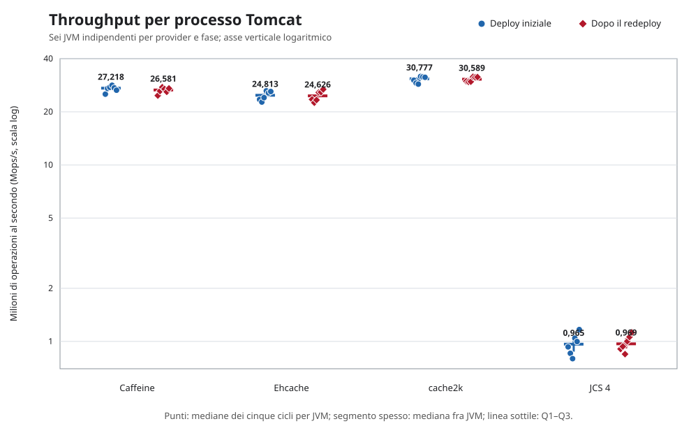
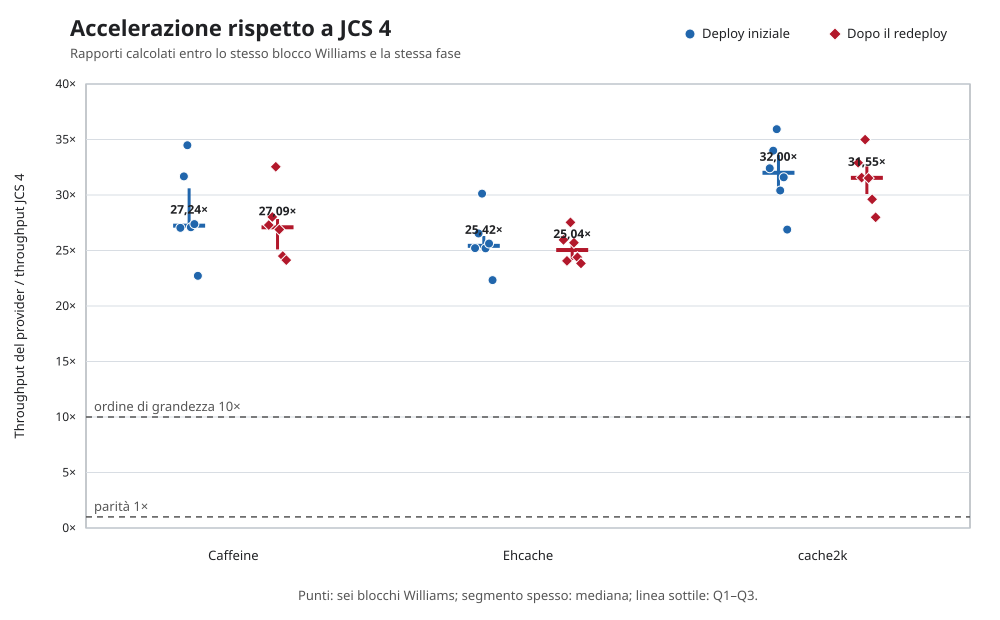
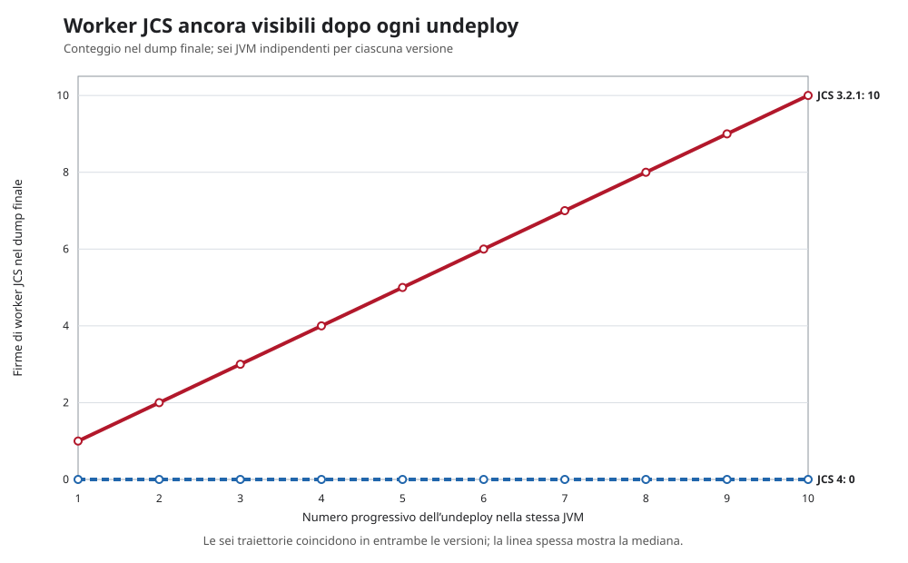

# Beyond Throughput: A Reproducible Benchmark of Java Caches in a Tomcat Lifecycle

*Prestazioni, correttezza osservabile e segnali post-undeploy di cache Java integrate in una web application*

Thomas Buffagni

LinkedIn: <https://www.linkedin.com/in/thomasbuffagni/>

Versione 1.0.0 — 3 settembre 2026  
Licenza: Creative Commons Attribuzione 4.0 Internazionale (CC BY 4.0)

**Parole chiave:** sistemi di caching Java, cache locali in memoria, benchmarking riproducibile, ingegneria delle prestazioni software, Apache Tomcat, lifecycle della JVM, redeploy di applicazioni web, rilevazione dei memory leak.

## Sommario

Questo studio confronta Caffeine, Ehcache, cache2k e Apache Commons JCS all'interno di una web application Tomcat, osservando l'intero ciclo di deploy, carico, rimozione e nuovo deploy. L'obiettivo non è stabilire quale cache sia migliore in assoluto, ma costruire un confronto verificabile che consideri insieme correttezza, prestazioni e rilascio delle risorse.

Il protocollo è stato definito e congelato prima della raccolta dei dati. Ogni condizione è stata eseguita in una JVM separata, mantenendo invariati applicazione, ambiente e carico. Nel percorso locale in memoria configurato, **{{V42_CONCLUSION_PERFORMANCE_MEDIANS}}**. Il risultato misura questa specifica integrazione applicativa e non si estende automaticamente a tutte le funzionalità o configurazioni dei progetti.

Il test successivo alla rimozione dell'applicazione ha inoltre riprodotto in **{{V42_JCS321_JCS248_POSITIVE_JVMS}}/6 repliche di JCS 3.2.1** il difetto per cui alcuni worker rimanevano attivi. Lo stesso difetto è comparso in **{{V42_JCS4_JCS248_POSITIVE_JVMS}}/6 repliche dello snapshot JCS 4**, che incorpora la correzione sviluppata dopo JCS-248. L'esito riguarda questo problema specifico, non ogni possibile forma di ritenzione della memoria. Protocollo, dati e strumenti rendono il confronto replicabile e costituiscono la baseline per verificare, in uno studio successivo, se JCS possa ridurre il divario prestazionale senza sacrificare correttezza e comportamento al redeploy.

## 1. Introduzione

Una cache incorporata nella JVM non è soltanto una mappa concorrente. Può gestire scadenze, callback, caricamenti e pool di thread. Queste funzioni influenzano sia il servizio durante il carico sia ciò che rimane quando l'applicazione viene arrestata.

Il problema è concreto nei servlet container. Tomcat può restare attivo mentre versioni successive della stessa applicazione vengono installate e rimosse. Ogni deploy usa un proprio *class loader*, il componente che carica le classi del WAR. Un thread avviato dall'applicazione non deve necessariamente scomparire in ogni implementazione, ma deve terminare oppure rilasciare i riferimenti che mantengono raggiungibile il vecchio class loader. Un nome di thread, da solo, non dimostra né ownership né ritenzione: servono sequenza temporale, stack, warning e, nei casi dubbi, analisi dei riferimenti dai GC root [2, 3].

Un test che termina insieme alla JVM non osserva questa fase. Al contrario, aggiungere un singolo conteggio di memoria a un test di throughput non risolve il problema: heap e memoria nativa appartengono all'intero processo. Lo studio separa quindi tre piani di evidenza:

1. conformità osservabile al workload dichiarato;
2. prestazioni del percorso applicativo durante il carico;
3. segnali raccolti dopo la rimozione della web application.

L'obiettivo non è proclamare una cache migliore in assoluto. È produrre un confronto controllabile nel quale artefatto, ambiente, carico, sequenza Tomcat e regole di analisi siano noti prima di leggere i risultati.

## 2. Domande di ricerca e contributi

Lo studio risponde a tre domande principali.

- **RQ1 — Correttezza osservabile.** Ogni condizione completa il carico minimo e rispetta i controlli dichiarati su hit rate, popolamento, single-flight e ritorno in servizio dopo il redeploy?
- **RQ2 — Prestazioni applicative.** Quali distribuzioni di throughput e latenza si osservano nei quattro provider primari usando lo stesso percorso applicativo e processi JVM distinti?
- **RQ3 — Lifecycle Tomcat.** Dopo l'undeploy, quali thread, warning e variazioni process-wide di heap, memoria nativa e class loader sono osservabili nei cicli successivi?

Il memory leak emerso analizzando JCS 3.2.1 e la sua mancata riproduzione nello snapshot JCS 4 sono trattati in una sezione autonoma. La successiva registrazione del difetto come JCS-248 documenta la segnalazione e la correzione upstream; il caso non viene usato per spiegare le differenze di throughput e non costituisce il fulcro del paper.

I contributi verificabili sono:

- un harness comune che esegue due deploy completi in ciascun ciclo;
- un disegno bilanciato con piani appaiati e una nuova JVM per ogni replica;
- gate semantici controllati prima dell'ammissione ai confronti prestazionali;
- una diagnostica post-undeploy con tempi effettivi e artefatti archiviati;
- un pacchetto dal quale rigenerare tabelle e grafici a partire dai dati raw.

Nel seguito, *correttezza osservabile* significa soltanto conformità al contratto verificato dall'harness. Non è una prova generale della correttezza delle librerie o di tutte le loro politiche di eviction, expiry e concorrenza.

## 3. Che cosa misura il benchmark

La finestra cronometrata attraversa l'adapter della condizione, i contatori comuni, la concorrenza applicativa e l'API del provider. La richiesta HTTP avvia il test, ma il round trip HTTP non è compreso nel timer. La misura descrive quindi il percorso usato dall'applicazione, non il costo isolato della sola struttura dati.

| Dimensione | Evidenza prodotta | Limite dell'interpretazione |
|---|---|---|
| Throughput | Operazioni completate divise per la durata effettiva | Non localizza il costo nel solo motore della cache |
| Latenza | Percentili delle operazioni campionate nell'adapter | Non è latenza HTTP end-to-end né una garanzia SLO |
| Correttezza osservabile | Durata, operazioni, hit rate, due conteggi di popolamento, single-flight e redeploy | Non dimostra equivalenza completa fra le API native |
| Thread e warning | ID, nomi, stack e messaggi Tomcat | Un thread vivo non è automaticamente un leak; deve essere verificato se trattiene riferimenti del WAR |
| Class loader e `findleaks` | Serie successive agli undeploy e occorrenze del context path | Le occorrenze di `findleaks` non contano class loader distinti |
| Heap e NMT | Valori dell'intero processo ai checkpoint dichiarati | Non attribuisce la memoria alla sola cache |

### 3.1 Il ruolo complementare di JMH

JMH è un harness per benchmark JVM dalla scala nano alla macro [1]. In questo studio, però, l'unità sperimentale comprende un processo Tomcat e l'intero ciclo del WAR; le misure principali sono quindi orchestrate dall'esterno. Benchmark JMH mirati potrebbero aiutare a separare il costo di singoli percorsi interni, ma non sostituiscono le osservazioni di deploy, undeploy e dei segnali post-undeploy.

## 4. Metodo

### 4.1 Protocollo definito prima dell'esecuzione

Il protocollo normativo è [`protocollo-campagna-v4-2.md`](protocollo-campagna-v4-2.md), SHA-256 `4F364DE62F696C687D3175931F29C69013F4AD9D96303558E2444BFC5C73596F`. È stato congelato il 2 settembre 2026, prima dell'acquisizione, e definisce condizioni, unità sperimentali, criteri di ammissione, misure e regole di analisi. Il relativo hash è registrato nella provenienza del dataset; tutti i valori del manoscritto derivano esclusivamente dagli artefatti v4.2 validati.

### 4.2 Sistemi, governance e versioni

#### 4.2.1 Profilo dei progetti

I quattro motori non sono varianti dello stesso prodotto: hanno obiettivi, ampiezza funzionale e modelli di governo differenti. La loro anzianità è riportata come contesto storico, non come indicatore automatico di qualità o prestazioni. Il riferimento temporale è il 3 settembre 2026. Quando il progetto non dichiara una data di fondazione, viene indicata la prima revisione del repository pubblico corrente; questa data potrebbe non comprendere eventuale lavoro precedente.

| Progetto | Versione o revisione provata | Chi mantiene il progetto (secondo i metadati ufficiali) | Licenza del progetto | Origine pubblicamente documentabile |
|---|---|---|---|---|
| Caffeine | `3.2.4`, pubblicata il 3 maggio 2026 | Progetto indipendente nel repository `ben-manes/caffeine`; il POM elenca Ben Manes nei ruoli `owner` e `developer`, con contributi gestiti pubblicamente su GitHub | Apache License 2.0 | Repository corrente avviato il 13 dicembre 2014: circa 11 anni e 9 mesi al momento dello studio [6, 18] |
| Ehcache | Artefatto Maven `org.ehcache:ehcache:3.12.0`, pubblicato il 3 aprile 2026; il tag sorgente `v3.12.0` punta al commit `f4a96f4` | Repository dell'organizzazione `ehcache`; il POM dell'artefatto identifica IBM Corp. e i *Terracotta Engineers*. Le note di Ehcache 3.11 descrivono quella linea come la prima nuova release sotto proprietà IBM | Apache License 2.0 | Ehcache fu introdotto nell'ottobre 2003, quasi 23 anni prima dello studio; il repository della linea Ehcache 3 parte dal febbraio 2014 [7, 19] |
| cache2k | `2.6.1.Final`, pubblicata il 7 febbraio 2022 | Progetto ospitato dall'organizzazione `cache2k`; il POM principale indica headissue GmbH e Jens Wilke, autore anche della guida ufficiale | Apache License 2.0 | Repository corrente avviato il 18 dicembre 2013: circa 12 anni e 9 mesi; le intestazioni del codice riportano copyright a partire dal 2000, dato che non equivale da solo a una data di prima pubblicazione [8, 21] |
| Apache Commons JCS | Release `3.2.1`, pubblicata il 27 maggio 2024, e snapshot `4.0.0-SNAPSHOT` al commit `fb3f101b` del 1° settembre 2026 | Progetto della Apache Software Foundation, sviluppato nell'ambito Apache Commons sotto la supervisione del Commons PMC e con contributi comunitari | Apache License 2.0 | Il sito ufficiale ne colloca sviluppo e uso dal 2001 e la creazione formale del progetto nel 2002: circa 24–25 anni di storia [16, 17, 22] |

Le quattro codebase adottano dunque la stessa licenza permissiva, ma non lo stesso modello di responsabilità: Caffeine è guidato dal maintainer che ospita il repository, cache2k dichiara un referente e un'organizzazione, Ehcache è mantenuto in un contesto aziendale e JCS segue la governance comunitaria della Apache Software Foundation. La licenza indicata riguarda il codice del progetto; le dipendenze transitive possono essere soggette a licenze differenti.

Una precisazione riguarda Ehcache `3.12.0`. L'artefatto e il relativo POM sono presenti su Maven Central, ma alla data di riferimento la pagina delle release del progetto presenta `3.11.1` come ultima release e non contiene un oggetto release per `3.12.0`; la questione è registrata nell'issue pubblica #3325 [7, 19, 20]. Il benchmark identifica separatamente l'artefatto binario eseguito, verificato tramite checksum, e il tag sorgente `v3.12.0` al commit `f4a96f4`, senza attribuire all'artefatto l'etichetta non verificata di «ultima release ufficiale».

#### 4.2.2 Perimetro tecnico osservato

La tabella seguente distingue ciò che ciascun progetto può fare in generale da ciò che viene effettivamente esercitato dal benchmark. È una distinzione essenziale: un risultato ottenuto sulla cache locale nell'*heap* — la memoria gestita dalla JVM — non descrive automaticamente i moduli distribuiti, il disco, lo storage *off-heap* — memoria esterna a quell'area — o le integrazioni offerte dallo stesso progetto. *JCache* indica lo standard Java JSR 107, che offre un'API comune per cache differenti.

| Progetto | Ambito generale del progetto | Configurazione misurata in questo studio | Funzioni non valutate |
|---|---|---|---|
| Caffeine | Cache locale in memoria con caricamento sincrono o asincrono, rimozione automatica quando viene superato il limite (*eviction*), scadenza e aggiornamento (*refresh*) | Heap della JVM, limite di 10.000 elementi, scadenza 300 s dopo la scrittura, lettura `getIfPresent`; statistiche native disattivate | API asincrone, refresh, riferimenti weak/soft, modulo JCache e politiche diverse da quella configurata [6, 18] |
| Ehcache | Cache locale o a più livelli, con storage nell'heap, off-heap e su disco; supporto JCache e opzioni di clustering | Solo heap della JVM, limite di 10.000 elementi, tempo di vita (TTL) di 300 s e accesso `Cache.get` | Off-heap, disco, persistenza, transazioni, JCache e clustering Terracotta [7, 19] |
| cache2k | Cache locale in memoria con scadenza, aggiornamento, caricamento automatico, gestione temporanea degli errori, statistiche e modulo JCache | `entryCapacity` 10.000, scadenza 300 s dopo la scrittura e lettura `peek`, senza caricatore nativo configurato | Refresh, resilienza, loader nativo, JCache e integrazioni applicative [8, 21] |
| Apache Commons JCS | Cache composita organizzata in *regioni* — cache logiche con un nome e una configurazione propri — con plugin di memoria, disco, comunicazione laterale e server remoto | Una sola regione, esclusivamente in memoria, con `LRUMemoryCache`, che rimuove per primi gli elementi usati meno di recente; `MaxObjects=10.000`, durata massima 300 s e nessun plugin ausiliario. Lo snapshot JCS 4 entra nel confronto prestazionale, JCS 3.2.1 nell'analisi lifecycle separata | Cache su disco, replica laterale, server remoto, failover, altri gestori di memoria e modulo JCache [17, 22] |

`no-store` non compare in questa panoramica perché non è un progetto esterno né un motore di caching: è il controllo interno del benchmark descritto fra le condizioni sperimentali qui sotto.

#### 4.2.3 Condizioni sperimentali

Le sei condizioni sono compilate nello stesso WAR e nella stessa immagine. Ogni processo esegue una sola condizione, così singleton e risorse globali di provider differenti non convivono nella stessa JVM.

| Codice | Condizione | Versione o revisione | Ruolo |
|---|---|---|---|
| A | Caffeine | 3.2.4 [6] | Confronto prestazionale primario |
| B | Ehcache | 3.12.0 [7] | Confronto prestazionale primario |
| C | cache2k | 2.6.1.Final [8] | Confronto prestazionale primario |
| D | snapshot JCS 4 | 4.0.0-SNAPSHOT, commit `fb3f101b87709b713468e8d827b8612e6e65f29b` [16] | Confronto prestazionale primario; include la correzione del leak analizzato separatamente |
| E | Apache Commons JCS | 3.2.1 distribuito [17] | Linea nella quale è stato rilevato il memory leak causato dai worker; analisi lifecycle separata |
| F | `no-store` | Nessuna libreria di cache: le scritture vengono ignorate e le letture non trovano mai il dato | Riferimento per distinguere i segnali dell'infrastruttura da quelli di una cache; escluso dal confronto prestazionale |

In termini semplici, `no-store` equivale a ripetere deploy, carico e undeploy con il «motore della cache» assente. Restano attivi Tomcat, il WAR, l'adapter, i contatori e la diagnostica comune, ma nessun dato viene conservato e nessuna risorsa appartiene a una libreria di caching. Per questo è utile nel confronto del lifecycle: un fenomeno presente sia con una cache sia con `no-store` non può essere assegnato alla sola cache sulla base di quel dato. Il suo throughput non viene invece confrontato con quello dei provider, perché ogni lettura provoca un nuovo caricamento e il lavoro eseguito è deliberatamente diverso.

Le versioni sono verificate sulle coordinate degli artefatti e su revisioni sorgente immutabili [4, 6–8, 16, 17]. La base del container usa Tomcat `11.0.24`; il sorgente citato è fissato al commit corrispondente [4].

| Condizione | Lettura nativa | Limite e TTL | Conteggio degli elementi | Chiusura richiesta |
|---|---|---|---|---|
| Caffeine | `getIfPresent` | `maximumSize`, `expireAfterWrite` | `estimatedSize` dopo cleanup | invalidazione e cleanup |
| Ehcache | `get` | heap entries, TTL | iterazione dei mapping | `CacheManager.close()` |
| cache2k | `peek` | `entryCapacity`, `expireAfterWrite` | `CacheControl.getSize()` | `Cache.close()` |
| JCS 4 e JCS 3.2.1 | `CacheAccess.get` | `LRUMemoryCache`, `MaxObjects`, attributi elemento | `CacheControl.getSize()` | `dispose()` e `JCS.shutdown()` |
| `no-store` | risponde sempre «dato non presente» (*miss*) | non applicabile | sempre zero | reset dei contatori comuni |

Hit e miss sono contati dall'adapter comune. Le statistiche native vengono archiviate come diagnostica ma non sostituiscono questi contatori. `recordStats()` di Caffeine resta disattivato, evitando di introdurre soltanto in quella condizione una telemetria facoltativa nel percorso principale.

### 4.3 Ambiente, repliche e ordine

| Parametro congelato | Valore |
|---|---|
| Runtime | Apache Tomcat 11.0.24 su Eclipse Temurin 25 |
| Immagine runtime | `tomcat:11.0.24-jdk25-temurin-noble` fissata tramite digest |
| CPU container | quota 4 vCPU |
| Memoria container | 1.536 MiB |
| Heap JVM | `-Xms256m -Xmx768m`, G1 |
| Native Memory Tracking | `summary` |
| Artefatto | stesso WAR per tutte le condizioni |

Il preflight registra e verifica digest delle immagini, versione JVM e Tomcat, limiti cgroup, CPU visibili, kernel, opzioni JVM, checksum del WAR e delle due linee JCS. Questi dati descrivono l'esecuzione effettiva e non vengono dedotti dai soli file di configurazione.

In questo studio una **JVM** (*Java Virtual Machine*) è un processo Java indipendente che esegue una propria istanza di Tomcat e il WAR sottoposto al test. Per ottenere una nuova replica, il container e la JVM vengono ricreati da zero: la prova successiva non eredita quindi oggetti, thread o cache Java dalla precedente. Nel seguito questa replica indipendente è chiamata anche *fork*.

Per ciascuna delle sei condizioni vengono avviate sei JVM indipendenti. All'interno di ogni JVM il test viene poi ripetuto cinque volte senza riavviare il processo. Ciascuna ripetizione è chiamata **ciclo** e comprende due misurazioni del carico: una sul deploy iniziale e una dopo avere rimosso e installato nuovamente il WAR. I cinque cicli della stessa JVM sono pertanto misure ripetute; non sono cinque repliche indipendenti.

Le sei JVM di ogni condizione non condividono stato Java, ma vengono eseguite in sequenza sullo stesso host e non rappresentano quindi sei macchine fisiche differenti. Il numero di sei replica una volta l'intero disegno Williams e non deriva da un calcolo formale di potenza statistica. Una *JVM valida* è un processo che ha superato i controlli di integrità infrastrutturale e provenienza; una *finestra ammessa* è una singola misurazione del carico che ha superato anche i controlli funzionali descritti nella sezione 4.6.

| Grandezza pianificata | Valore |
|---|---:|
| Condizioni sperimentali | 6 |
| Processi Tomcat indipendenti per condizione | 6 |
| Processi Tomcat complessivi | 36 |
| Cicli completi ripetuti in ciascun processo | 5 |
| Cicli complessivi | 180 |
| Misurazioni del carico per ciclo | 2: deploy iniziale e dopo il redeploy |
| Misurazioni del carico complessive | 360 |

In sintesi: **6 condizioni × 6 processi indipendenti × 5 cicli = 180 cicli**; poiché ogni ciclo contiene due misurazioni del carico, le finestre misurate sono **180 × 2 = 360**.

Il disegno prende il nome dal lavoro pubblicato da E. J. Williams nel 1949 sui cosiddetti esperimenti *change-over*, oggi generalmente ricondotti alla famiglia dei disegni *crossover*. Nel problema originale, più trattamenti vengono applicati in successione alla stessa unità sperimentale; l'ordine deve quindi consentire di distinguere l'effetto del trattamento corrente dall'eventuale effetto residuo di quello precedente. Williams mostrò come costruire sequenze bilanciate rispetto a questo effetto immediato. Con un numero pari di trattamenti, il bilanciamento può essere ottenuto con un solo quadrato di Williams: per sei trattamenti sono sufficienti sei sequenze di sei periodi [23, 24].

La letteratura definisce un disegno di questo tipo bilanciato rispetto agli effetti residui di primo ordine quando ogni trattamento occupa con la stessa frequenza ciascun periodo ed è preceduto con la stessa frequenza da ogni altro trattamento [23, 24]. In questo studio, tuttavia, l'applicazione è un adattamento al benchmarking: le cache non vengono eseguite una dopo l'altra nella stessa JVM, ma in processi indipendenti. La griglia di Williams viene utilizzata per controbilanciare l'ordine temporale delle prove sullo stesso host, non per stimare un effetto residuo fra motori di caching.

In termini pratici, il disegno Williams è il calendario del benchmark, non un test aggiuntivo né una correzione statistica applicata dopo aver visto i risultati. Stabilisce in quale ordine vengono eseguite le sei condizioni.

L'ordine è importante perché le prove avvengono in sequenza sullo stesso host. Se fossero lanciate sempre come A, B, C, D, E, F, la condizione A sarebbe sempre misurata per prima e F sempre per ultima. Un'eventuale differenza potrebbe allora riflettere, almeno in parte, il momento dell'esecuzione — per esempio temperatura e frequenza della CPU, attività di fondo o cache del sistema operativo — anziché soltanto il provider. Ricreare container e JVM impedisce di condividere direttamente lo stato Java, ma non rende irrilevante la posizione temporale della prova.

Il piano Williams 6 × 6 organizza quindi sei *blocchi*, ciascuno formato da un'esecuzione di tutte le sei condizioni. Nell'insieme dei blocchi valgono due regole di bilanciamento:

1. ogni condizione compare una volta in ciascuna posizione, dalla prima alla sesta;
2. ogni condizione viene eseguita subito dopo ciascuna delle altre esattamente una volta.

Per esempio, A non occupa sempre l'inizio della sequenza: nei sei blocchi compare una volta in ognuna delle sei posizioni ed è preceduta una volta da B, C, D, E e F. In questo modo vantaggi o svantaggi legati alla posizione e alla condizione eseguita immediatamente prima vengono distribuiti fra tutti i provider, anziché gravare sistematicamente su uno solo. Il disegno riduce queste possibili distorsioni, ma non elimina ogni variazione temporale e non trasforma le sei repliche in sei macchine indipendenti.

Le richieste inviate alle cache non vengono generate liberamente a ogni esecuzione. Due valori fissi, `24301` per il workload e `2482026` per la campagna, permettono di costruire in modo deterministico la sequenza delle chiavi da leggere. Combinandoli con il numero del blocco e del ciclo si ottiene un piano di accesso diverso per ogni ciclo, ma controllato e riproducibile.

Nello stesso blocco e ciclo, tutte le cache ricevono esattamente la stessa sequenza di richieste; la sequenza viene inoltre riutilizzata prima e dopo il redeploy. In questo modo, un'eventuale differenza non dipende dal fatto che un provider abbia ricevuto chiavi o accessi più favorevoli di un altro. Chi ripete l'esperimento con gli stessi valori può ricostruire gli stessi piani. Nella terminologia tecnica, i due valori fissi sono chiamati *seed*; i numeri in sé non hanno un significato prestazionale.

Quando un provider viene confrontato con JCS 4, il rapporto di throughput è calcolato fra misure appartenenti allo stesso blocco e alla stessa fase del test. Le due prove seguono quindi lo stesso piano, anche se vengono eseguite in JVM distinte.

| Blocco | Ordine A–F |
|---:|---|
| 1 | A, B, F, C, E, D |
| 2 | B, C, A, D, F, E |
| 3 | C, D, B, E, A, F |
| 4 | D, E, C, F, B, A |
| 5 | E, F, D, A, C, B |
| 6 | F, A, E, B, D, C |

### 4.4 Workload e controlli applicativi

| Parametro | Valore congelato |
|---|---:|
| Elementi caricati | 10.000 |
| Payload | 512 byte ASCII in UTF-8; non occupazione in heap |
| Worker | 8 |
| Hit pianificati | 95% |
| TTL | 300 s |
| Piano | uniforme, read-only, deterministico e pre-generato |
| Minimo per finestra | 400.000 operazioni e almeno 5,0 s |
| Warm-up minimo | 50.000 operazioni e almeno 3,0 s |
| Campionamento latenza | 1 operazione ogni 64 per worker |
| Write probe fuori misura | 5.000 `put` |
| Prova single-flight fuori misura | 16 chiamanti, loader artificiale di 25 ms |

Il carico è *closed-loop*: ogni worker avvia l'operazione successiva quando termina la precedente. Il piano viene ripetuto finché sono soddisfatti entrambi i minimi, operazioni e durata. Il risultato registra il numero effettivo di operazioni, la durata e l'overshoot.

Warm-up e misura usano la stessa istanza del provider. Terminato il warm-up, cache e contatori vengono azzerati prima del fill misurato. Il tratto prestazionale contiene soltanto letture. Fill, write probe e single-flight sono fuori dalla finestra principale e non sostengono conclusioni sulla velocità di scrittura.

La popolazione viene letta in due momenti non intercambiabili:

1. `providerMetricsAfterWorkload`, immediatamente prima della write probe;
2. `providerMetricsAfterWriteProbe`, dopo i 5.000 `put` diagnostici.

Il gate richiede entrambi i record espliciti. Dopo il secondo checkpoint, la prova single-flight lancia 16 chiamanti contro un loader controllato: il controllo passa se tutte le chiamate terminano e il loader viene invocato una sola volta. La prova appartiene all'adapter comune e non viene presentata come semantica nativa equivalente dei motori.

### 4.5 Sequenza Tomcat e diagnostica post-undeploy

Ogni ciclo esegue la stessa sequenza due volte, prima e dopo il redeploy.

| Passo | Azione | Evidenza |
|---:|---|---|
| 1 | Baseline con WAR assente | Stato JVM prima del deploy |
| 2 | Deploy e readiness | Snapshot idle |
| 3 | Warm-up, reset, fill e workload | Misure, doppio checkpoint, write probe e single-flight |
| 4 | Snapshot loaded, poi undeploy | Stato caricato e tempo di rimozione |
| 5 | Attesa minima di 2 s dall'undeploy | Thread dump e delta del log; nessuna GC esplicita del runner |
| 6 | Attesa minima di 10 s dall'undeploy | Avvio di `findleaks`, quindi due `GC.run`; a seguire heap, class loader, thread, NMT e istogramma classi |
| 7 | Redeploy | Nuova generazione del WAR e nuovo provider |
| 8 | Ripetizione dello stesso piano | Seconda finestra completa |
| 9 | Secondo undeploy | Stessa diagnostica precoce e finale |

I 2 e i 10 secondi sono soglie minime per iniziare le due sequenze, non istanti esatti ai quali tutte le misure sarebbero disponibili. Un orologio monotonic parte subito dopo il ritorno dell'undeploy e registra avvio e completamento della diagnostica precoce, avvio della diagnostica finale, completamento di `findleaks` e completamento dell'ultimo snapshot.

La diagnostica finale è sequenziale, assistita da GC e invasiva. Il comando Manager `findleaks` delega a `StandardHost.findReloadedContextMemoryLeaks()`, che invoca `System.gc()` [3, 4]. Questa invocazione esprime una richiesta alla JVM, non garantisce che la raccolta venga eseguita né che recuperi uno specifico insieme di oggetti [5]. Subito dopo, il runner invia due ulteriori richieste `jcmd GC.run`; quindi acquisisce, uno dopo l'altro, heap, statistiche dei class loader, thread dump, Native Memory Tracking (NMT) e istogramma. I valori finali descrivono lo stato successivo a questa sequenza diagnostica indotta, non un decorso passivo misurato esattamente a 10 secondi.

Dopo il secondo undeploy del quinto ciclo viene richiesto un heap dump per JCS 3.2.1 e per lo snapshot JCS 4. Gli artefatti diagnostici mantengono checksum e associazione all'intervallo che li ha prodotti.

### 4.6 Gate di correttezza e ammissione

| Controllo | Cache | `no-store` |
|---|---|---|
| Lavoro minimo | `measuredOperations ≥ 400.000` e durata ≥ 5,0 s | stesso criterio |
| Hit rate uniforme | 95% ± 0,5 punti percentuali | nessun dato trovato: hit rate 0% |
| Elementi dopo workload | almeno 9.900 | zero |
| Elementi dopo write probe | almeno 9.900 | zero |
| Single-flight | loader invocato esattamente una volta | non applicabile |
| Redeploy | readiness e ripetizione completa dello stesso piano | stesso criterio |

Una violazione semantica resta nei dati raw: non diventa un errore infrastrutturale. Una coppia fork–fase entra nel riepilogo prestazionale primario soltanto se tutti e cinque i cicli della fase superano il gate; nell'analisi senza il primo ciclo devono superarlo i cicli 2–5. OOM, riavvio inatteso, timeout, checksum errato o diagnostica obbligatoria mancante invalidano invece l'intero blocco Williams, che può essere ripetuto soltanto conservando il tentativo fallito e la motivazione.

### 4.7 Sintesi statistica

Per ogni provider e fase, la sintesi avviene in due passaggi:

1. mediana dei cinque cicli all'interno di ciascuna JVM;
2. mediana, primo e terzo quartile e intervallo minimo–massimo fra le mediane delle JVM ammesse.

Le cifre riportate nel sommario e nelle tabelle principali sono dunque **mediane fra processi JVM**, non medie delle 30 finestre. Il denominatore `n` viene sempre mostrato. Q1 e Q3 usano interpolazione lineare nella posizione `(n−1)p`.

I rapporti con JCS 4 sono calcolati entro lo stesso blocco e la stessa fase prima della sintesi: `throughput provider / throughput JCS 4`. La mediana dei rapporti appaiati non è il rapporto fra due mediane.

Le latenze p50, p95 e p99 derivano dal campione sistematico 1/64. Per ogni finestra si usa il rango più vicino superiore; i percentili di finestra vengono prima riassunti dentro la JVM e poi fra JVM. Il carico closed-loop non corregge la *coordinated omission*, cioè l'assenza di nuovi arrivi mentre una richiesta lenta è ancora in esecuzione.

L'analisi di sensibilità ricalcola le sintesi sui cicli 2–5. È un controllo descrittivo di robustezza, non una stima causale dell'effetto del primo ciclo: ordine temporale, compilazione JIT, stato del processo e altri fenomeni cambiano insieme. Se i fork ammessi differiscono fra analisi primaria e sensibilità, vengono mostrati entrambi i denominatori e la loro intersezione.

Per ciascuna JVM, la deriva fra cicli è descritta dalla pendenza \(b\) della retta \(y_c=a+bc\), stimata con minimi quadrati ordinari sui cinque checkpoint finali \(c=1,\ldots,5\) successivi al secondo undeploy. La pendenza esprime la variazione dell'indicatore per ciclo; con cinque osservazioni è una sintesi descrittiva, non una prova inferenziale di trend. Lo stimatore è fissato nel runner: il protocollo prespecificava l'uso di pendenze entro JVM, ma non ne esplicitava la formula. Per i class loader, \(y_c\) è il numero process-wide di righe `ParallelWebappClassLoader` restituito da `VM.classloader_stats`, non il numero di oggetti trattenuti. Non si concatenano cicli appartenenti a processi differenti. Non sono previsti punteggi compositi, pesi soggettivi, rimozione automatica di outlier o un vincitore automatico.

## 5. Aderenza al protocollo

{{V42_PROTOCOL_DEVIATIONS}}. La formula OLS era già implementata nel runner congelato, ma non era esplicitata nel documento testuale: si tratta di una lacuna nella documentazione preventiva del protocollo, non di una modifica introdotta dopo l'analisi. Questa dichiarazione riguarda soltanto gli scostamenti rilevabili negli artefatti e nei controlli archiviati.

## 6. Risultati

I valori delle tabelle sono estratti dal dataset v4.2 dopo la validazione dei dati raw, la rigenerazione dell'analisi e i controlli di provenienza.

### 6.1 Completezza e gate semantici

| Condizione | Processi acquisiti / 6 | JVM valide / 6 | Finestre acquisite / 60 | Gate superati / 60 | Coppie fork–fase ammesse / 12 |
|---|---:|---:|---:|---:|---:|
| Caffeine 3.2.4 | {{V42_CAFFEINE_PROCESSES}}/6 | {{V42_CAFFEINE_VALID_JVMS}}/6 | {{V42_CAFFEINE_WINDOWS}}/60 | {{V42_CAFFEINE_GATES}}/60 | {{V42_CAFFEINE_PHASE_PAIRS}}/12 |
| Ehcache 3.12.0 | {{V42_EHCACHE_PROCESSES}}/6 | {{V42_EHCACHE_VALID_JVMS}}/6 | {{V42_EHCACHE_WINDOWS}}/60 | {{V42_EHCACHE_GATES}}/60 | {{V42_EHCACHE_PHASE_PAIRS}}/12 |
| cache2k 2.6.1.Final | {{V42_CACHE2K_PROCESSES}}/6 | {{V42_CACHE2K_VALID_JVMS}}/6 | {{V42_CACHE2K_WINDOWS}}/60 | {{V42_CACHE2K_GATES}}/60 | {{V42_CACHE2K_PHASE_PAIRS}}/12 |
| snapshot JCS 4 | {{V42_JCS4_PROCESSES}}/6 | {{V42_JCS4_VALID_JVMS}}/6 | {{V42_JCS4_WINDOWS}}/60 | {{V42_JCS4_GATES}}/60 | {{V42_JCS4_PHASE_PAIRS}}/12 |
| JCS 3.2.1 | {{V42_JCS321_PROCESSES}}/6 | {{V42_JCS321_VALID_JVMS}}/6 | {{V42_JCS321_WINDOWS}}/60 | {{V42_JCS321_GATES}}/60 | non applicabile |
| `no-store` | {{V42_NOSTORE_PROCESSES}}/6 | {{V42_NOSTORE_VALID_JVMS}}/6 | {{V42_NOSTORE_WINDOWS}}/60 | {{V42_NOSTORE_GATES}}/60 | non applicabile |

| Controllo del disegno | Esito v4.2 |
|---|---:|
| Blocchi Williams completi / 6 | {{V42_COMPLETE_BLOCKS}}/6 |
| Blocchi invalidati / 6 | {{V42_INVALID_BLOCKS}}/6 |
| Blocchi ripetuti / 6 | {{V42_REPEATED_BLOCKS}}/6 |
| Container distinti / 36 JVM ammesse | {{V42_DISTINCT_CONTAINERS}}/36 |

I denominatori delle tabelle successive devono coincidere con le regole di ammissione; una misura esclusa rimane consultabile nei dati raw.

### 6.2 Evidenza osservata per RQ1

Le tabelle espongono gli estremi osservati nelle 60 finestre di ogni condizione. Durata e operazioni sono soglie minime: valori superiori sono attesi nel ciclo closed-loop. Il primo pannello descrive completezza del carico e ritorno in servizio.

| Condizione | Gate / 60 | Durata s, min–max | Operazioni, min–max | `ready` post-redeploy / 30 |
|---|---:|---:|---:|---:|
| Caffeine 3.2.4 | {{V42_CAFFEINE_GATES}}/60 | {{V42_CAFFEINE_RQ1_DURATION_RANGE_SECONDS}} | {{V42_CAFFEINE_RQ1_OPERATIONS_RANGE}} | {{V42_CAFFEINE_RQ1_REDEPLOY_READY}} |
| Ehcache 3.12.0 | {{V42_EHCACHE_GATES}}/60 | {{V42_EHCACHE_RQ1_DURATION_RANGE_SECONDS}} | {{V42_EHCACHE_RQ1_OPERATIONS_RANGE}} | {{V42_EHCACHE_RQ1_REDEPLOY_READY}} |
| cache2k 2.6.1.Final | {{V42_CACHE2K_GATES}}/60 | {{V42_CACHE2K_RQ1_DURATION_RANGE_SECONDS}} | {{V42_CACHE2K_RQ1_OPERATIONS_RANGE}} | {{V42_CACHE2K_RQ1_REDEPLOY_READY}} |
| snapshot JCS 4 | {{V42_JCS4_GATES}}/60 | {{V42_JCS4_RQ1_DURATION_RANGE_SECONDS}} | {{V42_JCS4_RQ1_OPERATIONS_RANGE}} | {{V42_JCS4_RQ1_REDEPLOY_READY}} |
| JCS 3.2.1 | {{V42_JCS321_GATES}}/60 | {{V42_JCS321_RQ1_DURATION_RANGE_SECONDS}} | {{V42_JCS321_RQ1_OPERATIONS_RANGE}} | {{V42_JCS321_RQ1_REDEPLOY_READY}} |
| `no-store` | {{V42_NOSTORE_GATES}}/60 | {{V42_NOSTORE_RQ1_DURATION_RANGE_SECONDS}} | {{V42_NOSTORE_RQ1_OPERATIONS_RANGE}} | {{V42_NOSTORE_RQ1_REDEPLOY_READY}} |

Il secondo pannello mostra i controlli semantici. L'hit rate è espresso in percentuale; le popolazioni sono lette prima e dopo la write probe. `Single-flight` riporta prove superate su prove applicabili.

| Condizione | Hit rate %, min–max | Popolazione dopo workload, min–max | Popolazione dopo write probe, min–max | Single-flight |
|---|---:|---:|---:|---:|
| Caffeine 3.2.4 | {{V42_CAFFEINE_RQ1_HIT_RATE_RANGE_PERCENT}} | {{V42_CAFFEINE_RQ1_POPULATION_AFTER_WORKLOAD_RANGE}} | {{V42_CAFFEINE_RQ1_POPULATION_AFTER_WRITE_RANGE}} | {{V42_CAFFEINE_RQ1_SINGLE_FLIGHT}} |
| Ehcache 3.12.0 | {{V42_EHCACHE_RQ1_HIT_RATE_RANGE_PERCENT}} | {{V42_EHCACHE_RQ1_POPULATION_AFTER_WORKLOAD_RANGE}} | {{V42_EHCACHE_RQ1_POPULATION_AFTER_WRITE_RANGE}} | {{V42_EHCACHE_RQ1_SINGLE_FLIGHT}} |
| cache2k 2.6.1.Final | {{V42_CACHE2K_RQ1_HIT_RATE_RANGE_PERCENT}} | {{V42_CACHE2K_RQ1_POPULATION_AFTER_WORKLOAD_RANGE}} | {{V42_CACHE2K_RQ1_POPULATION_AFTER_WRITE_RANGE}} | {{V42_CACHE2K_RQ1_SINGLE_FLIGHT}} |
| snapshot JCS 4 | {{V42_JCS4_RQ1_HIT_RATE_RANGE_PERCENT}} | {{V42_JCS4_RQ1_POPULATION_AFTER_WORKLOAD_RANGE}} | {{V42_JCS4_RQ1_POPULATION_AFTER_WRITE_RANGE}} | {{V42_JCS4_RQ1_SINGLE_FLIGHT}} |
| JCS 3.2.1 | {{V42_JCS321_RQ1_HIT_RATE_RANGE_PERCENT}} | {{V42_JCS321_RQ1_POPULATION_AFTER_WORKLOAD_RANGE}} | {{V42_JCS321_RQ1_POPULATION_AFTER_WRITE_RANGE}} | {{V42_JCS321_RQ1_SINGLE_FLIGHT}} |
| `no-store` | {{V42_NOSTORE_RQ1_HIT_RATE_RANGE_PERCENT}} | {{V42_NOSTORE_RQ1_POPULATION_AFTER_WORKLOAD_RANGE}} | {{V42_NOSTORE_RQ1_POPULATION_AFTER_WRITE_RANGE}} | {{V42_NOSTORE_RQ1_SINGLE_FLIGHT}} |

### 6.3 Throughput

Ogni riga sintetizza le mediane per-JVM dei cinque cicli. Le unità sono milioni di operazioni al secondo (Mops/s).

| Provider | Fase | Fork ammessi / 6 | Mediana fra fork | Q1–Q3 | Min–max |
|---|---|---:|---:|---:|---:|
| Caffeine | iniziale | {{V42_CAFFEINE_INITIAL_N}}/6 | {{V42_CAFFEINE_INITIAL_TPUT_MEDIAN}} | {{V42_CAFFEINE_INITIAL_TPUT_IQR}} | {{V42_CAFFEINE_INITIAL_TPUT_RANGE}} |
| Caffeine | redeploy | {{V42_CAFFEINE_REDEPLOY_N}}/6 | {{V42_CAFFEINE_REDEPLOY_TPUT_MEDIAN}} | {{V42_CAFFEINE_REDEPLOY_TPUT_IQR}} | {{V42_CAFFEINE_REDEPLOY_TPUT_RANGE}} |
| Ehcache | iniziale | {{V42_EHCACHE_INITIAL_N}}/6 | {{V42_EHCACHE_INITIAL_TPUT_MEDIAN}} | {{V42_EHCACHE_INITIAL_TPUT_IQR}} | {{V42_EHCACHE_INITIAL_TPUT_RANGE}} |
| Ehcache | redeploy | {{V42_EHCACHE_REDEPLOY_N}}/6 | {{V42_EHCACHE_REDEPLOY_TPUT_MEDIAN}} | {{V42_EHCACHE_REDEPLOY_TPUT_IQR}} | {{V42_EHCACHE_REDEPLOY_TPUT_RANGE}} |
| cache2k | iniziale | {{V42_CACHE2K_INITIAL_N}}/6 | {{V42_CACHE2K_INITIAL_TPUT_MEDIAN}} | {{V42_CACHE2K_INITIAL_TPUT_IQR}} | {{V42_CACHE2K_INITIAL_TPUT_RANGE}} |
| cache2k | redeploy | {{V42_CACHE2K_REDEPLOY_N}}/6 | {{V42_CACHE2K_REDEPLOY_TPUT_MEDIAN}} | {{V42_CACHE2K_REDEPLOY_TPUT_IQR}} | {{V42_CACHE2K_REDEPLOY_TPUT_RANGE}} |
| snapshot JCS 4 | iniziale | {{V42_JCS4_INITIAL_N}}/6 | {{V42_JCS4_INITIAL_TPUT_MEDIAN}} | {{V42_JCS4_INITIAL_TPUT_IQR}} | {{V42_JCS4_INITIAL_TPUT_RANGE}} |
| snapshot JCS 4 | redeploy | {{V42_JCS4_REDEPLOY_N}}/6 | {{V42_JCS4_REDEPLOY_TPUT_MEDIAN}} | {{V42_JCS4_REDEPLOY_TPUT_IQR}} | {{V42_JCS4_REDEPLOY_TPUT_RANGE}} |

**Figura 1.** Throughput del percorso adapter–provider. Ogni punto rappresenta la mediana dei cinque cicli di una JVM indipendente; il segmento spesso indica la mediana fra le sei JVM e la linea sottile l'intervallo Q1–Q3. La scala logaritmica consente di mostrare nello stesso pannello JCS 4 e gli altri provider senza nasconderne la variabilità.

**Rapporti appaiati rispetto allo snapshot JCS 4**

| Provider | Fase | Coppie ammesse / 6 | Mediana del rapporto | Q1–Q3 | Min–max |
|---|---|---:|---:|---:|---:|
| Caffeine | iniziale | {{V42_CAFFEINE_INITIAL_RATIO_N}}/6 | {{V42_CAFFEINE_INITIAL_RATIO_MEDIAN}}× | {{V42_CAFFEINE_INITIAL_RATIO_IQR}}× | {{V42_CAFFEINE_INITIAL_RATIO_RANGE}}× |
| Caffeine | redeploy | {{V42_CAFFEINE_REDEPLOY_RATIO_N}}/6 | {{V42_CAFFEINE_REDEPLOY_RATIO_MEDIAN}}× | {{V42_CAFFEINE_REDEPLOY_RATIO_IQR}}× | {{V42_CAFFEINE_REDEPLOY_RATIO_RANGE}}× |
| Ehcache | iniziale | {{V42_EHCACHE_INITIAL_RATIO_N}}/6 | {{V42_EHCACHE_INITIAL_RATIO_MEDIAN}}× | {{V42_EHCACHE_INITIAL_RATIO_IQR}}× | {{V42_EHCACHE_INITIAL_RATIO_RANGE}}× |
| Ehcache | redeploy | {{V42_EHCACHE_REDEPLOY_RATIO_N}}/6 | {{V42_EHCACHE_REDEPLOY_RATIO_MEDIAN}}× | {{V42_EHCACHE_REDEPLOY_RATIO_IQR}}× | {{V42_EHCACHE_REDEPLOY_RATIO_RANGE}}× |
| cache2k | iniziale | {{V42_CACHE2K_INITIAL_RATIO_N}}/6 | {{V42_CACHE2K_INITIAL_RATIO_MEDIAN}}× | {{V42_CACHE2K_INITIAL_RATIO_IQR}}× | {{V42_CACHE2K_INITIAL_RATIO_RANGE}}× |
| cache2k | redeploy | {{V42_CACHE2K_REDEPLOY_RATIO_N}}/6 | {{V42_CACHE2K_REDEPLOY_RATIO_MEDIAN}}× | {{V42_CACHE2K_REDEPLOY_RATIO_IQR}}× | {{V42_CACHE2K_REDEPLOY_RATIO_RANGE}}× |

**Figura 2.** Accelerazione rispetto allo snapshot JCS 4. Ogni punto confronta un provider con JCS 4 nello stesso blocco Williams e nella stessa fase; il segmento spesso è la mediana e la linea sottile è Q1–Q3. Le linee tratteggiate indicano la parità (`1×`) e un ordine di grandezza (`10×`).

I rapporti descrivono il percorso applicativo configurato. Non localizzano nel solo motore interno di JCS le cause di un eventuale divario.

### 6.4 Latenza campionata

| Provider | Fase | Fork ammessi / 6 | p50 mediana (µs) | p95 mediana (µs) | p99 mediana (µs) | Q1–Q3 del p99 (µs) |
|---|---|---:|---:|---:|---:|---:|
| Caffeine | iniziale | {{V42_CAFFEINE_INITIAL_LATENCY_N}}/6 | {{V42_CAFFEINE_INITIAL_P50_US}} | {{V42_CAFFEINE_INITIAL_P95_US}} | {{V42_CAFFEINE_INITIAL_P99_US}} | {{V42_CAFFEINE_INITIAL_P99_IQR_US}} |
| Caffeine | redeploy | {{V42_CAFFEINE_REDEPLOY_LATENCY_N}}/6 | {{V42_CAFFEINE_REDEPLOY_P50_US}} | {{V42_CAFFEINE_REDEPLOY_P95_US}} | {{V42_CAFFEINE_REDEPLOY_P99_US}} | {{V42_CAFFEINE_REDEPLOY_P99_IQR_US}} |
| Ehcache | iniziale | {{V42_EHCACHE_INITIAL_LATENCY_N}}/6 | {{V42_EHCACHE_INITIAL_P50_US}} | {{V42_EHCACHE_INITIAL_P95_US}} | {{V42_EHCACHE_INITIAL_P99_US}} | {{V42_EHCACHE_INITIAL_P99_IQR_US}} |
| Ehcache | redeploy | {{V42_EHCACHE_REDEPLOY_LATENCY_N}}/6 | {{V42_EHCACHE_REDEPLOY_P50_US}} | {{V42_EHCACHE_REDEPLOY_P95_US}} | {{V42_EHCACHE_REDEPLOY_P99_US}} | {{V42_EHCACHE_REDEPLOY_P99_IQR_US}} |
| cache2k | iniziale | {{V42_CACHE2K_INITIAL_LATENCY_N}}/6 | {{V42_CACHE2K_INITIAL_P50_US}} | {{V42_CACHE2K_INITIAL_P95_US}} | {{V42_CACHE2K_INITIAL_P99_US}} | {{V42_CACHE2K_INITIAL_P99_IQR_US}} |
| cache2k | redeploy | {{V42_CACHE2K_REDEPLOY_LATENCY_N}}/6 | {{V42_CACHE2K_REDEPLOY_P50_US}} | {{V42_CACHE2K_REDEPLOY_P95_US}} | {{V42_CACHE2K_REDEPLOY_P99_US}} | {{V42_CACHE2K_REDEPLOY_P99_IQR_US}} |
| snapshot JCS 4 | iniziale | {{V42_JCS4_INITIAL_LATENCY_N}}/6 | {{V42_JCS4_INITIAL_P50_US}} | {{V42_JCS4_INITIAL_P95_US}} | {{V42_JCS4_INITIAL_P99_US}} | {{V42_JCS4_INITIAL_P99_IQR_US}} |
| snapshot JCS 4 | redeploy | {{V42_JCS4_REDEPLOY_LATENCY_N}}/6 | {{V42_JCS4_REDEPLOY_P50_US}} | {{V42_JCS4_REDEPLOY_P95_US}} | {{V42_JCS4_REDEPLOY_P99_US}} | {{V42_JCS4_REDEPLOY_P99_IQR_US}} |

Questi percentili descrivono il campione di chiamate adapter–provider in closed-loop. Non vanno letti come tempi HTTP o come probabilità di rispettare un obiettivo di servizio esterno.

### 6.5 Analisi senza il primo ciclo

| Provider | Fase | Mediana cicli 1–5 (Mops/s) | Mediana cicli 2–5 (Mops/s) | Fork comuni / 6 | Variazione |
|---|---|---:|---:|---:|---:|
| Caffeine | iniziale | {{V42_CAFFEINE_INITIAL_PRIMARY_MEDIAN}} | {{V42_CAFFEINE_INITIAL_SENSITIVITY_MEDIAN}} | {{V42_CAFFEINE_INITIAL_COMMON_FORKS}}/6 | {{V42_CAFFEINE_INITIAL_SENSITIVITY_DELTA}}% |
| Caffeine | redeploy | {{V42_CAFFEINE_REDEPLOY_PRIMARY_MEDIAN}} | {{V42_CAFFEINE_REDEPLOY_SENSITIVITY_MEDIAN}} | {{V42_CAFFEINE_REDEPLOY_COMMON_FORKS}}/6 | {{V42_CAFFEINE_REDEPLOY_SENSITIVITY_DELTA}}% |
| Ehcache | iniziale | {{V42_EHCACHE_INITIAL_PRIMARY_MEDIAN}} | {{V42_EHCACHE_INITIAL_SENSITIVITY_MEDIAN}} | {{V42_EHCACHE_INITIAL_COMMON_FORKS}}/6 | {{V42_EHCACHE_INITIAL_SENSITIVITY_DELTA}}% |
| Ehcache | redeploy | {{V42_EHCACHE_REDEPLOY_PRIMARY_MEDIAN}} | {{V42_EHCACHE_REDEPLOY_SENSITIVITY_MEDIAN}} | {{V42_EHCACHE_REDEPLOY_COMMON_FORKS}}/6 | {{V42_EHCACHE_REDEPLOY_SENSITIVITY_DELTA}}% |
| cache2k | iniziale | {{V42_CACHE2K_INITIAL_PRIMARY_MEDIAN}} | {{V42_CACHE2K_INITIAL_SENSITIVITY_MEDIAN}} | {{V42_CACHE2K_INITIAL_COMMON_FORKS}}/6 | {{V42_CACHE2K_INITIAL_SENSITIVITY_DELTA}}% |
| cache2k | redeploy | {{V42_CACHE2K_REDEPLOY_PRIMARY_MEDIAN}} | {{V42_CACHE2K_REDEPLOY_SENSITIVITY_MEDIAN}} | {{V42_CACHE2K_REDEPLOY_COMMON_FORKS}}/6 | {{V42_CACHE2K_REDEPLOY_SENSITIVITY_DELTA}}% |
| snapshot JCS 4 | iniziale | {{V42_JCS4_INITIAL_PRIMARY_MEDIAN}} | {{V42_JCS4_INITIAL_SENSITIVITY_MEDIAN}} | {{V42_JCS4_INITIAL_COMMON_FORKS}}/6 | {{V42_JCS4_INITIAL_SENSITIVITY_DELTA}}% |
| snapshot JCS 4 | redeploy | {{V42_JCS4_REDEPLOY_PRIMARY_MEDIAN}} | {{V42_JCS4_REDEPLOY_SENSITIVITY_MEDIAN}} | {{V42_JCS4_REDEPLOY_COMMON_FORKS}}/6 | {{V42_JCS4_REDEPLOY_SENSITIVITY_DELTA}}% |

La tabella misura quanto cambia la sintesi quando il primo ciclo viene omesso. Non identifica la causa del cambiamento e non autorizza ad attribuirlo a warm-up, JIT o caching senza un esperimento separato.

### 6.6 Lifecycle Tomcat

Questa sezione confronta i quattro provider primari con `no-store`; il confronto diagnostico fra JCS 3.2.1 e lo snapshot JCS 4 è riportato separatamente nella sezione 7. `no-store` rappresenta ciò che il test osserva quando l'intera infrastruttura funziona ma nessun motore di cache conserva dati o avvia proprie risorse. Ogni condizione dispone di dieci intervalli post-undeploy per JVM, sessanta complessivi. Per `findleaks` vengono conservati sia la presenza del context path per JVM sia l'output di ciascuna invocazione. La somma delle occorrenze fra invocazioni diverse conta osservazioni: lo stesso class loader può essere osservato più volte e, non essendo archiviata un'identità dell'oggetto nell'output testuale, quel totale non rappresenta il numero di class loader distinti rimasti al checkpoint finale.

| Condizione | JVM lifecycle valide / 6 | Intervalli valutabili / 60 | Intervalli con warning thread-leak / 60 | JVM con warning / 6 | JVM con context path in `findleaks` / 6 |
|---|---:|---:|---:|---:|---:|
| Caffeine | {{V42_CAFFEINE_LIFECYCLE_JVMS}}/6 | {{V42_CAFFEINE_LIFECYCLE_INTERVALS}}/60 | {{V42_CAFFEINE_THREAD_WARNING_INTERVALS}}/60 | {{V42_CAFFEINE_THREAD_WARNING_JVMS}}/6 | {{V42_CAFFEINE_FINDLEAKS_JVMS}}/6 |
| Ehcache | {{V42_EHCACHE_LIFECYCLE_JVMS}}/6 | {{V42_EHCACHE_LIFECYCLE_INTERVALS}}/60 | {{V42_EHCACHE_THREAD_WARNING_INTERVALS}}/60 | {{V42_EHCACHE_THREAD_WARNING_JVMS}}/6 | {{V42_EHCACHE_FINDLEAKS_JVMS}}/6 |
| cache2k | {{V42_CACHE2K_LIFECYCLE_JVMS}}/6 | {{V42_CACHE2K_LIFECYCLE_INTERVALS}}/60 | {{V42_CACHE2K_THREAD_WARNING_INTERVALS}}/60 | {{V42_CACHE2K_THREAD_WARNING_JVMS}}/6 | {{V42_CACHE2K_FINDLEAKS_JVMS}}/6 |
| snapshot JCS 4 | {{V42_JCS4_LIFECYCLE_JVMS}}/6 | {{V42_JCS4_LIFECYCLE_INTERVALS}}/60 | {{V42_JCS4_THREAD_WARNING_INTERVALS}}/60 | {{V42_JCS4_THREAD_WARNING_JVMS}}/6 | {{V42_JCS4_FINDLEAKS_JVMS}}/6 |
| `no-store` | {{V42_NOSTORE_LIFECYCLE_JVMS}}/6 | {{V42_NOSTORE_LIFECYCLE_INTERVALS}}/60 | {{V42_NOSTORE_THREAD_WARNING_INTERVALS}}/60 | {{V42_NOSTORE_THREAD_WARNING_JVMS}}/6 | {{V42_NOSTORE_FINDLEAKS_JVMS}}/6 |

| Condizione | Delta thread vivi a C5 rispetto al baseline del processo, mediana [min–max] | Pendenza thread/ciclo, mediana [min–max] | Pendenza righe process-wide `ParallelWebappClassLoader`/ciclo, mediana [min–max] |
|---|---:|---:|---:|
| Caffeine | {{V42_CAFFEINE_THREAD_FINAL_DELTA}} | {{V42_CAFFEINE_THREAD_SLOPE}} | {{V42_CAFFEINE_CLASSLOADER_SLOPE}} |
| Ehcache | {{V42_EHCACHE_THREAD_FINAL_DELTA}} | {{V42_EHCACHE_THREAD_SLOPE}} | {{V42_EHCACHE_CLASSLOADER_SLOPE}} |
| cache2k | {{V42_CACHE2K_THREAD_FINAL_DELTA}} | {{V42_CACHE2K_THREAD_SLOPE}} | {{V42_CACHE2K_CLASSLOADER_SLOPE}} |
| snapshot JCS 4 | {{V42_JCS4_THREAD_FINAL_DELTA}} | {{V42_JCS4_THREAD_SLOPE}} | {{V42_JCS4_CLASSLOADER_SLOPE}} |
| `no-store` | {{V42_NOSTORE_THREAD_FINAL_DELTA}} | {{V42_NOSTORE_THREAD_SLOPE}} | {{V42_NOSTORE_CLASSLOADER_SLOPE}} |

| Condizione | Pendenza heap MiB/ciclo, mediana [min–max] | Pendenza NMT MiB/ciclo, mediana [min–max] |
|---|---:|---:|
| Caffeine | {{V42_CAFFEINE_HEAP_SLOPE}} | {{V42_CAFFEINE_NMT_SLOPE}} |
| Ehcache | {{V42_EHCACHE_HEAP_SLOPE}} | {{V42_EHCACHE_NMT_SLOPE}} |
| cache2k | {{V42_CACHE2K_HEAP_SLOPE}} | {{V42_CACHE2K_NMT_SLOPE}} |
| snapshot JCS 4 | {{V42_JCS4_HEAP_SLOPE}} | {{V42_JCS4_NMT_SLOPE}} |
| `no-store` | {{V42_NOSTORE_HEAP_SLOPE}} | {{V42_NOSTORE_NMT_SLOPE}} |

Le grandezze riportate sono conteggi o misure dell'intera JVM. Un offset stabile di thread e una crescita progressiva sono fenomeni diversi; nessuno dei due assegna automaticamente i thread a un provider. L'interpretazione deve usare insieme serie, stack, warning, controllo `no-store` e tempi effettivi della diagnostica.

## 7. Dal memory leak osservato in JCS 3.2.1 alla correzione in JCS 4

Questa sezione è distinta dal confronto prestazionale. Il caso nasce dall'analisi del lifecycle di JCS 3.2.1: dopo l'undeploy, i worker delle code di eventi rimanevano vivi e conservavano riferimenti alle risorse del WAR, impedendo il corretto rilascio della web application. Il difetto è stato registrato soltanto in seguito come JCS-248 [9]. Nel seguito, *memory leak dei worker JCS* indica questo specifico problema di lifecycle, non qualunque possibile forma di ritenzione della memoria.

### 7.1 Il memory leak osservato in JCS 3.2.1

Il difetto è emerso durante la messa a punto del benchmark, quando JCS-248 non esisteva ancora. L'analisi di JCS 3.2.1 ha mostrato l'accumulo di worker `JCS-ElementEventQueue-*` attraverso ripetuti redeploy Tomcat. Il 20 agosto 2026 Thomas Buffagni, autore di questo studio, ha quindi aperto il ticket JCS-248 per registrare il problema e il caso riproducibile [9].

In JCS 3.2.1, `ElementEventQueue` crea il proprio executor chiamando direttamente `ThreadPoolManager.createPool()`. Il pool restituito non viene registrato nelle mappe dei pool nominati del manager. Quando la cache esegue `dispose()`, la coda viene marcata come distrutta, ma l'executor non viene arrestato; la chiusura globale del manager, a sua volta, può raggiungere soltanto i pool presenti nelle proprie mappe. Il worker resta quindi fuori da entrambi i percorsi di chiusura [10]. Questa analisi tecnica spiega il comportamento osservato in JCS 3.2.1. Dopo la correzione upstream, la linea 3.2.1 è stata mantenuta nel protocollo v4.2 come riferimento diagnostico per verificare se lo stesso comportamento fosse ancora presente nello snapshot JCS 4; non partecipa al confronto prestazionale.

### 7.2 Dalla proposta iniziale alla soluzione upstream

Nello stesso giorno del ticket, la PR #415 propose una correzione locale: rendere esplicita l'ownership dell'executor e invocare `shutdownNow()` nel `dispose()` della coda [11]. Il maintainer scelse poi un intervento più ampio sulla gestione condivisa e sul lifecycle dei pool. La cronologia distingue la proposta dell'autore dal codice effettivamente misurato.

| Data 2026 | Evento | Ruolo |
|---|---|---|
| 20 agosto | Ticket JCS-248 [9] e PR #415, commit `08ee88f` [11] | Segnalazione riproducibile e proposta locale dell'autore; il commit non è incluso nello snapshot misurato |
| 26 agosto | Commit `85b906c` [12] | Il maintainer porta `ElementEventQueue` sotto un executor nominato gestito centralmente e introduce un rilascio esplicito |
| 27 agosto | Commit `0de0497` [13] | Aggiunge il conteggio degli utilizzatori e coordina il rilascio dei pool condivisi con la chiusura del manager |
| 1° settembre | Commit `ee410ef` [14] | Consolida sincronizzazione, gestione degli scheduler e chiusura globale |
| 1° settembre | Commit documentale `e830edc` [15] | Documenta la configurazione dei pool schedulati; non costituisce un ulteriore intervento correttivo |
| 1° settembre | Snapshot `fb3f101b` [16] | Revisione sottoposta al benchmark; discende dalle correzioni del maintainer, mentre la modifica propria del commit riguarda il locking delle memory cache |

Apache ha registrato JCS-248 come `Fixed` il 1° settembre, con versione di destinazione JCS 4.0 [9]. Lo snapshot misurato incorpora la linea di correzione del maintainer, ma non il commit proposto nella PR #415. La sequenza documenta che la correzione upstream è successiva all'apertura del ticket; non isola però l'effetto causale di un singolo commit.

### 7.3 Confronto diagnostico definito a priori

Dopo la scoperta del difetto e la correzione upstream, il protocollo v4.2 ha definito, prima dell'esecuzione, il confronto fra le due linee JCS. L'obiettivo è verificare se la procedura riproduca in JCS 3.2.1 il comportamento già osservato e se quello stesso comportamento compaia ancora nello snapshot JCS 4.

Ogni JVM produce dieci controlli successivi agli undeploy. Un singolo controllo viene considerato una **doppia conferma del difetto** quando, nello stesso momento di osservazione:

1. compare almeno una firma di thread JCS nota nel dump precoce o finale;
2. il log Tomcat contiene almeno un warning di thread-leak relativo alla web application.

Una replica viene quindi conteggiata fra quelle **in cui il difetto è stato rilevato** se almeno uno dei suoi dieci controlli presenta entrambi i segnali. Il conteggio per replica risponde alla domanda «in quanti processi indipendenti è comparso il problema?»; il conteggio per intervallo indica invece «dopo quanti undeploy è comparso?». La procedura è considerata capace di riprodurre il caso JCS 3.2.1 se il difetto viene rilevato in almeno cinque delle sei repliche. Le misure di heap, memoria nativa e class loader forniscono informazioni aggiuntive, ma non determinano questo esito.

### 7.4 Esito del confronto

| Linea JCS | Repliche valide / 6 | Controlli post-undeploy valutabili / 60 | Controlli con doppia conferma / 60 | Repliche con difetto rilevato / 6 | Warning thread-leak |
|---|---:|---:|---:|---:|---:|
| Apache Commons JCS 3.2.1 | {{V42_JCS321_JCS248_VALID_JVMS}}/6 | {{V42_JCS321_JCS248_INTERVALS}}/60 | {{V42_JCS321_JCS248_CORROBORATED_INTERVALS}}/60 | {{V42_JCS321_JCS248_POSITIVE_JVMS}}/6 | {{V42_JCS321_JCS248_WARNING_EVENTS}} |
| snapshot JCS 4 | {{V42_JCS4_JCS248_VALID_JVMS}}/6 | {{V42_JCS4_JCS248_INTERVALS}}/60 | {{V42_JCS4_JCS248_CORROBORATED_INTERVALS}}/60 | {{V42_JCS4_JCS248_POSITIVE_JVMS}}/6 | {{V42_JCS4_JCS248_WARNING_EVENTS}} |

**Figura 3.** Firme dei worker JCS ancora presenti nel dump finale successivo a ciascun undeploy. Le sei traiettorie coincidono: JCS 3.2.1 cresce da uno a dieci worker, mentre lo snapshot JCS 4 rimane a zero. Il grafico visualizza il segnale nei thread dump; la doppia conferma con i warning Tomcat è riportata nella tabella precedente.

| Linea JCS | Pendenza thread/ciclo, mediana [min–max] | Pendenza righe process-wide `ParallelWebappClassLoader`/ciclo, mediana [min–max] | Pendenza heap MiB/ciclo, mediana [min–max] | Pendenza NMT MiB/ciclo, mediana [min–max] |
|---|---:|---:|---:|---:|
| Apache Commons JCS 3.2.1 | {{V42_JCS321_JCS248_THREAD_SLOPE}} | {{V42_JCS321_JCS248_CLASSLOADER_SLOPE}} | {{V42_JCS321_JCS248_HEAP_SLOPE}} | {{V42_JCS321_JCS248_NMT_SLOPE}} |
| snapshot JCS 4 | {{V42_JCS4_JCS248_THREAD_SLOPE}} | {{V42_JCS4_JCS248_CLASSLOADER_SLOPE}} | {{V42_JCS4_JCS248_HEAP_SLOPE}} | {{V42_JCS4_JCS248_NMT_SLOPE}} |

Il riconoscimento non è cieco alla nomenclatura della nuova linea: il matcher individua un worker JCS 4 in tutti i 60 snapshot acquisiti mentre il WAR è caricato, ma nessuna firma nei 120 dump successivi agli undeploy.

{{V42_JCS248_INTERPRETATION}}

## 8. Risposte sintetiche alle domande di ricerca

**RQ1 — Correttezza osservabile.** {{V42_RQ1_ANSWER}}

**RQ2 — Prestazioni applicative.** {{V42_RQ2_ANSWER}}

**RQ3 — Lifecycle Tomcat.** {{V42_RQ3_ANSWER}}

## 9. Discussione

### 9.1 Leggere insieme risultati diversi

Il throughput descrive il servizio durante il carico; i gate indicano se quel numero è stato ottenuto rispettando il contratto; la diagnostica osserva cosa accade quando il WAR viene rimosso. Una cache veloce con gate falliti non produce un confronto valido. Allo stesso modo, un warning dopo l'undeploy non può essere cancellato da un throughput elevato.

Tutte le finestre dei provider primari hanno superato i gate. Nel workload read-only configurato, cache2k registra la mediana più alta, seguita da Caffeine ed Ehcache; JCS 4 resta separato da un divario superiore a un ordine di grandezza. L'ordine e il divario cambiano poco fra deploy iniziale e redeploy e restano visibili nell'analisi che omette il primo ciclo. Il risultato è quindi consistente all'interno di questa campagna, ma non costituisce una classifica generale e non ne localizza automaticamente la causa. Profilazione, JMH e studi di ablazione sono gli strumenti successivi per distinguere adapter, contatori, sincronizzazione e struttura dati.

### 9.2 Interpretare i segnali lifecycle

Un thread residuo è problematico quando continua a lavorare per l'applicazione rimossa o conserva riferimenti che ne impediscono il rilascio. Può invece restare vivo come infrastruttura condivisa dopo aver abbandonato tali riferimenti. Per questo il paper non trasforma il solo conteggio dei thread in un verdetto.

`findleaks` richiede la lettura più prudente. In una singola invocazione Tomcat restituisce i context path associati ai class loader non più attivi che risultano ancora raggiungibili dopo la richiesta di GC [4, 5]. Nella serie del benchmark, però, lo stesso oggetto può ricomparire a più checkpoint: sommare le righe significa contare osservazioni, non class loader distinti. L'attribuzione definitiva di una ritenzione richiede un heap dump e il percorso verso i GC root.

## 10. Minacce alla validità

| Area | Limite | Mitigazione adottata | Estensione futura |
|---|---|---|---|
| Generalizzabilità | Un host, una quota CPU, un heap e un workload read-only uniforme | Ambiente congelato, sei processi per condizione, ordine Williams | Repliche su host, GC e carichi differenti |
| Unità sperimentale | Le JVM sono separate ma condividono host e periodo di esecuzione | Sintesi prima dentro ogni processo; nessun pooling dei cicli | Repliche indipendenti su più macchine |
| Equivalenza dei provider | API, politiche e costo del conteggio non sono identici | Contratto comune esplicito e gate semantici | Matrici dedicate a write, eviction ed expiry |
| Attribuzione prestazionale | Il timer include adapter e contatori | Stesso WAR, endpoint e flusso dell'harness; adapter specifico dichiarato per ciascuna condizione | Profilazione e JMH mirati |
| Campionamento latenza | Closed-loop e campione sistematico 1/64 | Metodo e denominatori pubblicati | Generatore open-loop dedicato |
| Diagnostica | `findleaks` e GC esplicite alterano lo stato osservato | Ordine, soglie minime e tempi effettivi archiviati | Finestra passiva separata |
| Ownership dei thread | Nome e conteggio non provano riferimenti al WAR | Stack completi, warning e firme limitate a JCS | Context class loader e GC-root analysis |
| Memoria process-wide | Heap e NMT includono JVM, Tomcat e applicazione | Serie dentro la stessa JVM e controllo `no-store` | Allocazioni per componente e heap-dump analysis |
| Sensibilità | Omettere ciclo 1 non identifica un meccanismo causale | Risultato etichettato come descrittivo | Esperimento dedicato a warm-up e stato JVM |

## 11. Riproducibilità e provenienza

Il pacchetto di riproduzione comprende:

- protocollo v4.2 congelato e identificato tramite SHA-256;
- sorgenti dell'harness e test automatici;
- Dockerfile, Compose e immagini fissate tramite digest;
- snapshot del sorgente JCS 4 e artefatto JCS 3.2.1 verificato tramite checksum;
- piano Williams, seed e checksum dei piani di accesso;
- JSON raw, file di analisi, CSV, workbook e grafici;
- log Tomcat, thread dump, classloader stats, NMT, istogrammi e heap dump JCS previsti;
- validatore offline che ricalcola gate, denominatori e tabelle dai raw.

| Artefatto | Identificazione |
|---|---|
| Protocollo definitivo | `press/article/protocollo-campagna-v4-2.md`; SHA-256 `4F364DE62F696C687D3175931F29C69013F4AD9D96303558E2444BFC5C73596F` |
| Runner | `scripts/run_benchmark.py`; versione inclusa nella provenance del dataset v4.2 |
| Validatore | `scripts/validate_campaign_v4.py`; versione inclusa nella provenance del dataset v4.2 |
| Estrattore del paper | `scripts/extract_paper_v4_2.py`; genera i valori destinati alle tabelle v4.2 |
| Dati e diagnostica | Nomi, dimensioni e SHA-256 sono riportati nel manifest `press/results/SHA256SUMS` |
| Tabelle e grafici | `scripts/generate_paper_figures.py`; rigenerati esclusivamente dai file v4.2 validati |

I dati raw non vengono sovrascritti dall'analisi; tabelle e figure sono rigenerate esclusivamente dagli artefatti v4.2 validati.

## 12. Conclusione: dalla baseline alla sfida preregistrata

Il contributo centrale è un criterio di confronto più ampio del solo throughput. In una web application Tomcat, velocità, conformità del workload e segnali post-undeploy rispondono a domande diverse e devono essere misurati separatamente.

La campagna ha prodotto una base completa e verificata: **{{V42_CONCLUSION_COMPLETION_AND_GATES}}**. Nel percorso configurato, **{{V42_CONCLUSION_PERFORMANCE_MEDIANS}}**.

Le evidenze lifecycle comprendono **{{V42_CONCLUSION_LIFECYCLE_COUNTS}}**, ma la diagnostica generale non attribuisce il segnale a uno specifico provider. Il confronto dedicato riproduce invece il memory leak causato dai worker in JCS 3.2.1 e non lo osserva nello snapshot JCS 4: **{{V42_CONCLUSION_JCS248_COUNTS}}**. Nel perimetro del protocollo v4.2, il comportamento rilevato analizzando JCS 3.2.1 è quindi scomparso nella revisione JCS 4 che incorpora la correzione upstream. L'evidenza è coerente con la risoluzione dello specifico difetto; non dimostra l'assenza di altre forme di ritenzione e non attribuisce l'esito a un singolo commit.

La baseline apre una domanda più ambiziosa: **può un team di agenti di intelligenza artificiale intervenire sul motore di un progetto open source con molti anni di sviluppo alle spalle e migliorare di oltre 10× il throughput del percorso JCS configurato?**

Il secondo studio non valuterà la capacità di produrre codice plausibile, ma un risultato ingegneristico verificabile. Prima di modificare JCS saranno congelati commit di partenza, workload, fork, scenari di validazione e soglia di successo. Il miglioramento dovrà essere misurato contro la baseline v4.2 con confronti appaiati, ripetersi prima e dopo il redeploy e superare 10× secondo il criterio preregistrato. Dovrà inoltre conservare tutti i gate funzionali, rispettare soglie esplicite di non inferiorità per gli indicatori lifecycle prescelti e superare test e scenari non usati durante l'ottimizzazione. Solo l'insieme di queste condizioni potrà trasformare la sfida in evidenza, qualunque sia il suo esito.

## Riferimenti

1. OpenJDK, *Java Microbenchmark Harness (JMH) 1.37*, sorgente fissato al commit `2effa2c`: <https://github.com/openjdk/jmh/tree/2effa2c8310e1d3ad03c8ee02024edca9252b46a>
2. Apache Tomcat, *Memory Leak Protection*: <https://cwiki.apache.org/confluence/display/tomcat/memoryleakprotection>
3. Apache Tomcat 11, *Manager App — Finding memory leaks*: <https://tomcat.apache.org/tomcat-11.0-doc/manager-howto.html>
4. Apache Tomcat `11.0.24`, sorgenti immutabili di [`ManagerServlet.findleaks()`](https://github.com/apache/tomcat/blob/4f33a9eca48c5cbf5963dd213b74866e629154ad/java/org/apache/catalina/manager/ManagerServlet.java#L481-L503) e [`StandardHost.findReloadedContextMemoryLeaks()`](https://github.com/apache/tomcat/blob/4f33a9eca48c5cbf5963dd213b74866e629154ad/java/org/apache/catalina/core/StandardHost.java#L699-L722), commit `4f33a9e`.
5. Java SE 25, API `System.gc()`: <https://docs.oracle.com/en/java/javase/25/docs/api/java.base/java/lang/System.html#gc()>
6. Caffeine `3.2.4`, sorgente fissato al commit `836b65c`: <https://github.com/ben-manes/caffeine/tree/836b65c0a83e5d1641ded9c6de578654bc04b2e9>
7. Ehcache `3.12.0`, [POM dell'artefatto Maven Central](https://repo1.maven.org/maven2/org/ehcache/ehcache/3.12.0/ehcache-3.12.0.pom) e [sorgente che fissa `ehcacheVersion = 3.12.0`](https://github.com/ehcache/ehcache3/commit/f4a96f47758e8d0bbe3de81c371bdbb33d620b88), commit `f4a96f4`.
8. cache2k `2.6.1.Final`, sorgente fissato al commit `334aced`: <https://github.com/cache2k/cache2k/tree/334aced7a6aa6bcbf4060c379050488484bb00fb>
9. Apache Commons JCS, issue JCS-248, aperta da Thomas Buffagni il 20 agosto 2026 e registrata come `Fixed` il 1° settembre 2026: <https://issues.apache.org/jira/browse/JCS-248>
10. Apache Commons JCS 3.2.1, sorgenti immutabili di [`ElementEventQueue`](https://github.com/apache/commons-jcs/blob/2d54b71517cb2baf7d38107978b96a780a1c162c/commons-jcs-core/src/main/java/org/apache/commons/jcs3/engine/control/event/ElementEventQueue.java), [`CompositeCache.dispose()`](https://github.com/apache/commons-jcs/blob/2d54b71517cb2baf7d38107978b96a780a1c162c/commons-jcs-core/src/main/java/org/apache/commons/jcs3/engine/control/CompositeCache.java) e [`ThreadPoolManager`](https://github.com/apache/commons-jcs/blob/2d54b71517cb2baf7d38107978b96a780a1c162c/commons-jcs-core/src/main/java/org/apache/commons/jcs3/utils/threadpool/ThreadPoolManager.java), release commit `2d54b71`.
11. Apache Commons JCS, [PR #415](https://github.com/apache/commons-jcs/pull/415), aperta da Thomas Buffagni, e commit proposto `08ee88f`, *Shut down element event queue worker*: <https://github.com/apache/commons-jcs/commit/08ee88fdce83940b377e38811945678593c5d240>
12. Apache Commons JCS, commit `85b906c`, *Unify the handling of thread pools and their lifecycle. Fixes JCS-248*: <https://github.com/apache/commons-jcs/commit/85b906cf4611bc4837c05d69eabfe406a414b047>
13. Apache Commons JCS, commit `0de0497`, *Second round of thread pool lifecycle fixes. JCS-248*: <https://github.com/apache/commons-jcs/commit/0de0497adf13aa68a4294a85cee73706cd7356a0>
14. Apache Commons JCS, commit `ee410ef`, *Improve thread pool handling*: <https://github.com/apache/commons-jcs/commit/ee410efe4a15b777ad28f5e43d282c2e9363edff>
15. Apache Commons JCS, commit documentale `e830edc`, *Document scheduled pool configuration*: <https://github.com/apache/commons-jcs/commit/e830edcbb9d7bd94760b30e6aec94f1677e860e9>
16. Apache Commons JCS, commit congelato `fb3f101b`, *Fix inconsistent locking*: <https://github.com/apache/commons-jcs/commit/fb3f101b87709b713468e8d827b8612e6e65f29b>
17. Maven Central, POM di Apache Commons JCS Core 3.2.1: <https://repo1.maven.org/maven2/org/apache/commons/commons-jcs3-core/3.2.1/commons-jcs3-core-3.2.1.pom>
18. Caffeine, [POM 3.2.4](https://repo1.maven.org/maven2/com/github/ben-manes/caffeine/caffeine/3.2.4/caffeine-3.2.4.pom), [prima revisione del repository corrente](https://github.com/ben-manes/caffeine/commit/97b7960d4c8a5a79379c807f3b2405375abd9ebd) e [release 3.2.4](https://github.com/ben-manes/caffeine/releases/tag/v3.2.4).
19. Ehcache, [storia del progetto](https://www.ehcache.org/documentation/ehcache-2.5.x-documentation.pdf), [prima revisione del repository Ehcache 3](https://github.com/ehcache/ehcache3/commit/046016fb66b96d91e6904625e085787233ce5b88) e [release Ehcache 3.11.1 sotto proprietà IBM](https://github.com/ehcache/ehcache3/releases/tag/v3.11.1).
20. Ehcache, issue #3325, *What is status of 3.12.0?*: <https://github.com/ehcache/ehcache3/issues/3325>
21. cache2k, [POM principale 2.6.1.Final](https://repo1.maven.org/maven2/org/cache2k/cache2k-parent/2.6.1.Final/cache2k-parent-2.6.1.Final.pom), [prima revisione del repository corrente](https://github.com/cache2k/cache2k/commit/24f3c740319ed3222052fb028190c890803d7ea0), [guida ufficiale](https://cache2k.org/docs/latest/user-guide.html) e [release 2.6.1.Final](https://github.com/cache2k/cache2k/releases/tag/v2.6.1.Final).
22. Apache Commons JCS, [panoramica ufficiale](https://commons.apache.org/proper/commons-jcs/), [storia del progetto](https://commons.apache.org/proper/commons-jcs/ProjectHistory.html) e [team Apache Commons](https://commons.apache.org/team-list.html).
23. Williams, E. J. (1949), *Experimental Designs Balanced for the Estimation of Residual Effects of Treatments*, **Australian Journal of Scientific Research, Series A**, 2(2), 149–168: <https://doi.org/10.1071/CH9490149>
24. Penn State, STAT 509, *Crossover Designs — Balanced Designs*: <https://online.stat.psu.edu/stat509/Lesson12>
